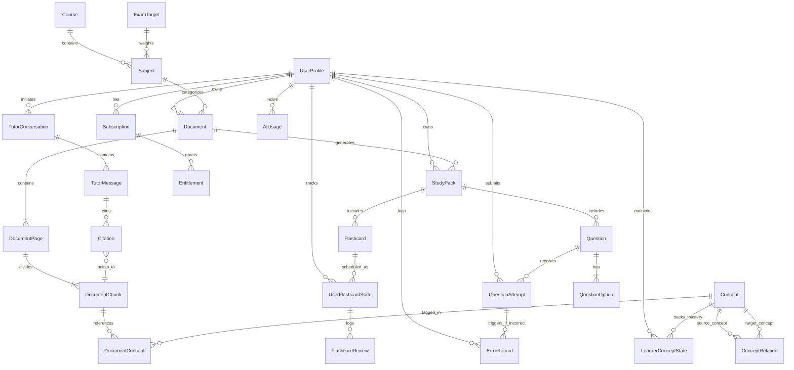

# MedStudy Atlas — Conceptual & Logical Data Model

## 1. Overview & System of Record
PostgreSQL (hosted on Supabase) serves as the primary system of record for MedStudy Atlas.
- **Relational Integrity**: Foreign keys, check constraints, and transactional consistency.
- **Multi-Model In-Database Capabilities**:
  - `JSONB` for flexible, schema-versioned Study Pack contents and question metadata.
  - `tsvector` + GIN indexes for full-text lexical search (Spanish config).
  - `vector` (via `pgvector`) for semantic embedding search.
- **Tenant Isolation**: Row Level Security (RLS) policies enforce strict per-user data isolation based on `auth.uid()`.

---

## 2. Entity Categorization (MVP vs Later)

| Entity | Domain | Classification | Notes |
| :--- | :--- | :--- | :--- |
| `User` | Identity | **MVP REQUIRED** | Supabase `auth.users` managed. |
| `UserProfile` | Identity | **MVP REQUIRED** | Medical student metadata, academic context, onboarding completion marker. |
| `Course` | Curriculum | **DEFERRED** | Course hierarchy deferred until real curriculum requirements justify it; Subject serves as primary container. |
| `Subject` | Curriculum | **MVP REQUIRED** | User-owned academic subject/course/module (e.g., Anatomía, Fisiología) with RLS and active unique index. |
| `ExamTarget` | Curriculum | **MVP REQUIRED** | Upcoming exam blueprint with composite foreign key enforcing subject owner integrity. |
| `Document` | Documents | **MVP REQUIRED** | Top-level uploaded file record. |
| `DocumentVersion` | Documents | **MVP REQUIRED** | Versioning for document re-uploads / updates. |
| `DocumentPage` | Documents | **MVP REQUIRED** | Page-level metadata, classification (text vs scan), image ref. |
| `DocumentSection` | Documents | **LATER** | Structural chapter/heading hierarchy (flattened to Chunks in MVP). |
| `DocumentChunk` | Documents | **MVP REQUIRED** | Token-bounded text chunk with embedding and FTS tsvector. |
| `Concept` | Knowledge | **MVP REQUIRED** | Core medical concept (disease, symptom, drug, structure). |
| `ConceptRelation` | Knowledge | **MVP REQUIRED** | Edge in PostgreSQL concept graph (`IS_A`, `CAUSES`, etc.). |
| `DocumentConcept` | Knowledge | **MVP REQUIRED** | Join table linking document chunks to concepts. |
| `StudyPack` | Learning | **MVP REQUIRED** | Cached aggregate study pack for a document. |
| `StudyPackVersion` | Learning | **LATER** | Versioned iterations of generated packs (MVP uses 1:1 StudyPack). |
| `Flashcard` | Learning | **MVP REQUIRED** | Front/back retrieval practice item. |
| `UserFlashcardState` | Learning | **MVP REQUIRED** | FSRS scheduling state (stability, difficulty, due date). |
| `FlashcardReview` | Learning | **MVP REQUIRED** | Historical log of spaced repetition review attempts. |
| `Question` | Assessment | **MVP REQUIRED** | Multiple-choice clinical vignette or question. |
| `QuestionOption` | Assessment | **MVP REQUIRED** | Distractors and correct answer with explanations. |
| `QuestionAttempt` | Assessment | **MVP REQUIRED** | Student response, response time, correctness. |
| `ErrorRecord` | Assessment | **MVP REQUIRED** | Error Notebook: recurring misconception and rationale. |
| `LearnerConceptState` | Learning | **MVP REQUIRED** | Deterministic mastery, confidence, forgetting risk per concept. |
| `StudySession` | Learning | **MVP REQUIRED** | Active study time block tracking. |
| `StudyPlan` | Learning | **MVP REQUIRED** | Daily "Today" plan container. |
| `StudyPlanItem` | Learning | **MVP REQUIRED** | Individual task in the Today plan (cards to review, MCQs). |
| `TutorConversation` | Tutor | **MVP REQUIRED** | Thread of chat with the context-grounded AI Tutor. |
| `TutorMessage` | Tutor | **MVP REQUIRED** | Message in conversation with evidence state and role. |
| `Citation` | Tutor | **MVP REQUIRED** | Exact link between TutorMessage and DocumentChunk / Page. |
| `AIUsage` | AI / Billing | **MVP REQUIRED** | Token telemetry, feature type, estimated cost per request. |
| `Subscription` | Billing | **MVP REQUIRED** | Current subscription status (Free vs PRO), period end. |
| `Entitlement` | Billing | **MVP REQUIRED** | Feature quotas and usage counters (uploads, AI calls). |
| `PaymentEvent` | Billing | **MVP REQUIRED** | Record of payments from gateway. |
| `WebhookEvent` | Billing | **MVP REQUIRED** | Idempotency log for incoming webhooks. |
| `MedicalSource` | Provenance | **LATER / OPTIONAL** | Authoritative clinical source (guideline, textbook edition). |
| `MedicalAssetLicense` | Provenance | **LATER / OPTIONAL** | Specific asset copyright and commercial reuse verification. |

---

## 3. Entity-Relationship Diagram (ERD)



---

## 4. Key Logical Schemas (DDL Design)

### Identity & Profiles
```sql
CREATE TABLE user_profiles (
    id UUID PRIMARY KEY REFERENCES auth.users(id) ON DELETE CASCADE,
    email TEXT NOT NULL,
    full_name TEXT,
    medical_school TEXT,
    year_of_study INT CHECK (year_of_study BETWEEN 1 AND 10),
    onboarding_completed_at TIMESTAMPTZ,
    created_at TIMESTAMPTZ NOT NULL DEFAULT NOW(),
    updated_at TIMESTAMPTZ NOT NULL DEFAULT NOW()
);
```

### Curriculum & Exam Targets
```sql
CREATE TABLE subjects (
    id UUID PRIMARY KEY DEFAULT gen_random_uuid(),
    user_id UUID NOT NULL REFERENCES auth.users(id) ON DELETE CASCADE,
    name TEXT NOT NULL,
    created_at TIMESTAMPTZ NOT NULL DEFAULT NOW(),
    updated_at TIMESTAMPTZ NOT NULL DEFAULT NOW(),
    archived_at TIMESTAMPTZ,
    CONSTRAINT uq_subjects_id_user_id UNIQUE (id, user_id)
);

CREATE UNIQUE INDEX idx_subjects_user_name_unique
    ON subjects (user_id, lower(trim(name)))
    WHERE archived_at IS NULL;

CREATE TABLE exam_targets (
    id UUID PRIMARY KEY DEFAULT gen_random_uuid(),
    user_id UUID NOT NULL REFERENCES auth.users(id) ON DELETE CASCADE,
    subject_id UUID,
    title TEXT NOT NULL,
    exam_date DATE NOT NULL,
    created_at TIMESTAMPTZ NOT NULL DEFAULT NOW(),
    updated_at TIMESTAMPTZ NOT NULL DEFAULT NOW(),
    archived_at TIMESTAMPTZ,
    CONSTRAINT fk_exam_targets_subject_owner FOREIGN KEY (subject_id, user_id)
        REFERENCES subjects(id, user_id)
        ON DELETE SET NULL (subject_id)
);
```

> **Non-Blocking Data Model Debt (Acknowledged)**:
> - `user_profiles.email` duplicates the canonical `auth.users.email` and can become stale if email change support is added later. Before implementing account-email changes, we must either: (A) remove duplicated profile email and read canonical Auth email, or (B) implement reliable synchronization.
> - `Course` hierarchy container is deferred until real curriculum requirements justify it. `Subject` serves as the primary curriculum container for the MVP.

### Documents & Chunks
```sql
CREATE TABLE documents (
    id UUID PRIMARY KEY DEFAULT gen_random_uuid(),
    user_id UUID NOT NULL REFERENCES auth.users(id) ON DELETE CASCADE,
    subject_id UUID,
    original_filename TEXT NOT NULL,
    storage_provider TEXT NOT NULL DEFAULT 'supabase',
    storage_bucket TEXT NOT NULL DEFAULT 'documents',
    storage_key TEXT NOT NULL UNIQUE,
    mime_type TEXT NOT NULL DEFAULT 'application/pdf',
    size_bytes BIGINT NOT NULL,
    status TEXT NOT NULL DEFAULT 'UPLOADING' CHECK (status IN ('UPLOADING', 'READY', 'REJECTED', 'FAILED')),
    validation_error_code TEXT,
    sha256_hash TEXT,
    created_at TIMESTAMPTZ NOT NULL DEFAULT NOW(),
    updated_at TIMESTAMPTZ NOT NULL DEFAULT NOW(),
    archived_at TIMESTAMPTZ,
    CONSTRAINT fk_documents_subject_owner FOREIGN KEY (subject_id, user_id)
        REFERENCES subjects(id, user_id)
        ON DELETE SET NULL (subject_id),
    CONSTRAINT chk_documents_filename_length CHECK (length(trim(original_filename)) > 0 AND length(trim(original_filename)) <= 255),
    CONSTRAINT chk_documents_size_positive CHECK (size_bytes > 0 AND size_bytes <= 26214400),
    CONSTRAINT chk_documents_mime_type CHECK (mime_type = 'application/pdf')
);

CREATE TABLE document_pages (
    id UUID PRIMARY KEY DEFAULT gen_random_uuid(),
    document_id UUID NOT NULL REFERENCES documents(id) ON DELETE CASCADE,
    page_number INT NOT NULL,
    classification TEXT NOT NULL CHECK (classification IN ('TEXT_BASED', 'SCANNED', 'IMAGE_BASED', 'MIXED')),
    has_ocr BOOLEAN NOT NULL DEFAULT FALSE,
    raw_text TEXT,
    created_at TIMESTAMPTZ NOT NULL DEFAULT NOW(),
    UNIQUE(document_id, page_number)
);

CREATE TABLE document_chunks (
    id UUID PRIMARY KEY DEFAULT gen_random_uuid(),
    document_id UUID NOT NULL REFERENCES documents(id) ON DELETE CASCADE, -- Tenant isolation via documents.user_id join
    page_number INT NOT NULL,
    chunk_index INT NOT NULL,
    content TEXT NOT NULL,
    token_count INT NOT NULL,
    tsv_content TSVECTOR GENERATED ALWAYS AS (to_tsvector('spanish', content)) STORED,
    embedding VECTOR(1536), -- INITIAL SCHEMA PLACEHOLDER: specific dimension, provider, and model selected in Slice 1D
    embedding_provider TEXT, -- e.g. 'openai', 'gemini' (selected in Slice 1D)
    embedding_model TEXT, -- e.g. 'text-embedding-3-small', 'text-embedding-004'
    embedding_dimension INT DEFAULT 1536,
    embedding_version INT NOT NULL DEFAULT 1,
    metadata JSONB NOT NULL DEFAULT '{}',
    created_at TIMESTAMPTZ NOT NULL DEFAULT NOW(),
    UNIQUE(document_id, chunk_index)
);

-- Re-Embedding Migration Strategy:
-- 1. `embedding_version` tracks model generation (v1=initial, v2=updated).
-- 2. If model/dimension changes, a new column `embedding_v2 VECTOR(N)` is added and populated asynchronously by the worker.
-- 3. Search queries match the active `embedding_version` until all active documents are migrated.
-- 4. `VECTOR(1536)` is an initial schema placeholder. Exact dimension is pinned when AI provider is finalized in Slice 1D.

CREATE INDEX idx_chunks_tsv ON document_chunks USING GIN(tsv_content);
CREATE INDEX idx_chunks_embedding ON document_chunks USING hnsw (embedding vector_cosine_ops);
CREATE INDEX idx_chunks_doc_page ON document_chunks(document_id, page_number);
```

### Knowledge Graph (PostgreSQL-Native)
```sql
CREATE TABLE concepts (
    id UUID PRIMARY KEY DEFAULT gen_random_uuid(),
    canonical_name TEXT NOT NULL UNIQUE,
    category TEXT NOT NULL CHECK (category IN ('DISEASE', 'SYMPTOM', 'DRUG', 'ANATOMY', 'PHYSIOLOGY', 'PATHOLOGY', 'LAB_FINDING')),
    description TEXT,
    icd10_code TEXT,
    created_at TIMESTAMPTZ NOT NULL DEFAULT NOW()
);

CREATE TABLE concept_relations (
    id UUID PRIMARY KEY DEFAULT gen_random_uuid(),
    source_concept_id UUID NOT NULL REFERENCES concepts(id) ON DELETE CASCADE,
    target_concept_id UUID NOT NULL REFERENCES concepts(id) ON DELETE CASCADE,
    relation_type TEXT NOT NULL CHECK (relation_type IN (
        'IS_A', 'PART_OF', 'RELATED_TO', 'CAUSES', 
        'HAS_FUNCTION', 'TREATED_BY', 'LOCATED_IN', 'ASSOCIATED_WITH'
    )),
    weight NUMERIC(3, 2) DEFAULT 1.0,
    created_at TIMESTAMPTZ NOT NULL DEFAULT NOW(),
    UNIQUE(source_concept_id, target_concept_id, relation_type)
);

CREATE INDEX idx_concept_rel_source ON concept_relations(source_concept_id);
CREATE INDEX idx_concept_rel_target ON concept_relations(target_concept_id);
```

### Learning, Spaced Repetition (FSRS) & Study Packs
```sql
CREATE TABLE study_packs (
    id UUID PRIMARY KEY DEFAULT gen_random_uuid(),
    document_id UUID NOT NULL REFERENCES documents(id) ON DELETE CASCADE,
    user_id UUID NOT NULL REFERENCES user_profiles(id) ON DELETE CASCADE,
    summary TEXT NOT NULL,
    learning_objectives JSONB NOT NULL DEFAULT '[]',
    key_terms JSONB NOT NULL DEFAULT '[]',
    status TEXT NOT NULL CHECK (status IN ('GENERATING', 'READY', 'FAILED')),
    qa_status TEXT NOT NULL DEFAULT 'PENDING' CHECK (qa_status IN ('PENDING', 'PASSED', 'FAILED')),
    created_at TIMESTAMPTZ NOT NULL DEFAULT NOW()
);

CREATE TABLE flashcards (
    id UUID PRIMARY KEY DEFAULT gen_random_uuid(),
    study_pack_id UUID REFERENCES study_packs(id) ON DELETE CASCADE,
    document_id UUID REFERENCES documents(id) ON DELETE SET NULL,
    concept_id UUID REFERENCES concepts(id) ON DELETE SET NULL,
    front TEXT NOT NULL,
    back TEXT NOT NULL,
    explanation TEXT,
    provenance JSONB NOT NULL DEFAULT '{}', -- {page: 4, chunkId: "...", quote: "..."}
    created_at TIMESTAMPTZ NOT NULL DEFAULT NOW()
);

CREATE TABLE user_flashcard_states (
    id UUID PRIMARY KEY DEFAULT gen_random_uuid(),
    user_id UUID NOT NULL REFERENCES user_profiles(id) ON DELETE CASCADE,
    flashcard_id UUID NOT NULL REFERENCES flashcards(id) ON DELETE CASCADE,
    -- FSRS Parameters
    stability REAL NOT NULL DEFAULT 0.0,
    difficulty REAL NOT NULL DEFAULT 0.0,
    elapsed_days INT NOT NULL DEFAULT 0,
    scheduled_days INT NOT NULL DEFAULT 0,
    reps INT NOT NULL DEFAULT 0,
    lapses INT NOT NULL DEFAULT 0,
    state INT NOT NULL DEFAULT 0, -- 0=New, 1=Learning, 2=Review, 3=Relearning
    due_at TIMESTAMPTZ NOT NULL DEFAULT NOW(),
    last_reviewed_at TIMESTAMPTZ,
    UNIQUE(user_id, flashcard_id)
);

CREATE INDEX idx_flashcard_due ON user_flashcard_states(user_id, due_at);

CREATE TABLE flashcard_reviews (
    id UUID PRIMARY KEY DEFAULT gen_random_uuid(),
    user_id UUID NOT NULL REFERENCES user_profiles(id) ON DELETE CASCADE,
    flashcard_id UUID NOT NULL REFERENCES flashcards(id) ON DELETE CASCADE,
    rating INT NOT NULL CHECK (rating BETWEEN 1 AND 4), -- 1=Again, 2=Hard, 3=Good, 4=Easy
    review_duration_ms INT,
    reviewed_at TIMESTAMPTZ NOT NULL DEFAULT NOW()
);
```

### Assessment & Error Notebook
```sql
CREATE TABLE questions (
    id UUID PRIMARY KEY DEFAULT gen_random_uuid(),
    study_pack_id UUID REFERENCES study_packs(id) ON DELETE CASCADE,
    subject_id UUID REFERENCES subjects(id),
    concept_id UUID REFERENCES concepts(id),
    vignette TEXT NOT NULL,
    explanation TEXT NOT NULL,
    difficulty TEXT CHECK (difficulty IN ('EASY', 'MEDIUM', 'HARD')),
    provenance JSONB NOT NULL DEFAULT '{}',
    qa_status TEXT NOT NULL DEFAULT 'PENDING' CHECK (qa_status IN ('PENDING', 'PASSED', 'FAILED')),
    created_at TIMESTAMPTZ NOT NULL DEFAULT NOW()
);

CREATE TABLE question_options (
    id UUID PRIMARY KEY DEFAULT gen_random_uuid(),
    question_id UUID NOT NULL REFERENCES questions(id) ON DELETE CASCADE,
    option_letter CHAR(1) NOT NULL, -- 'A', 'B', 'C', 'D', 'E'
    text TEXT NOT NULL,
    is_correct BOOLEAN NOT NULL,
    rationale TEXT,
    UNIQUE(question_id, option_letter)
);

CREATE TABLE question_attempts (
    id UUID PRIMARY KEY DEFAULT gen_random_uuid(),
    user_id UUID NOT NULL REFERENCES user_profiles(id) ON DELETE CASCADE,
    question_id UUID NOT NULL REFERENCES questions(id) ON DELETE CASCADE,
    selected_option_id UUID NOT NULL REFERENCES question_options(id),
    is_correct BOOLEAN NOT NULL,
    response_time_ms INT,
    created_at TIMESTAMPTZ NOT NULL DEFAULT NOW()
);

CREATE TABLE error_records (
    id UUID PRIMARY KEY DEFAULT gen_random_uuid(),
    user_id UUID NOT NULL REFERENCES user_profiles(id) ON DELETE CASCADE,
    question_id UUID NOT NULL REFERENCES questions(id) ON DELETE CASCADE,
    concept_id UUID REFERENCES concepts(id),
    misconception_type TEXT CHECK (misconception_type IN ('KNOWLEDGE_GAP', 'MISREAD_QUESTION', 'CONFUSED_CONCEPTS', 'REASONING_ERROR')),
    user_notes TEXT,
    reviewed_count INT DEFAULT 1,
    resolved BOOLEAN NOT NULL DEFAULT FALSE,
    created_at TIMESTAMPTZ NOT NULL DEFAULT NOW()
);
```

### Learner State & Today Plan
```sql
CREATE TABLE learner_concept_states (
    id UUID PRIMARY KEY DEFAULT gen_random_uuid(),
    user_id UUID NOT NULL REFERENCES user_profiles(id) ON DELETE CASCADE,
    concept_id UUID NOT NULL REFERENCES concepts(id) ON DELETE CASCADE,
    mastery NUMERIC(3, 2) NOT NULL DEFAULT 0.00 CHECK (mastery BETWEEN 0.00 AND 1.00),
    confidence NUMERIC(3, 2) NOT NULL DEFAULT 0.00 CHECK (confidence BETWEEN 0.00 AND 1.00),
    forgetting_risk NUMERIC(3, 2) NOT NULL DEFAULT 1.00 CHECK (forgetting_risk BETWEEN 0.00 AND 1.00),
    attempt_count INT NOT NULL DEFAULT 0,
    correct_count INT NOT NULL DEFAULT 0,
    incorrect_count INT NOT NULL DEFAULT 0,
    error_recurrence INT NOT NULL DEFAULT 0,
    last_attempt_at TIMESTAMPTZ,
    last_reviewed_at TIMESTAMPTZ,
    next_review_at TIMESTAMPTZ,
    updated_at TIMESTAMPTZ NOT NULL DEFAULT NOW(),
    UNIQUE(user_id, concept_id)
);

CREATE INDEX idx_learner_mastery ON learner_concept_states(user_id, mastery);
CREATE INDEX idx_learner_forgetting ON learner_concept_states(user_id, forgetting_risk DESC);

CREATE TABLE study_plans (
    id UUID PRIMARY KEY DEFAULT gen_random_uuid(),
    user_id UUID NOT NULL REFERENCES user_profiles(id) ON DELETE CASCADE,
    plan_date DATE NOT NULL,
    target_minutes INT NOT NULL DEFAULT 45,
    status TEXT NOT NULL CHECK (status IN ('PENDING', 'IN_PROGRESS', 'COMPLETED')),
    created_at TIMESTAMPTZ NOT NULL DEFAULT NOW(),
    UNIQUE(user_id, plan_date)
);

CREATE TABLE study_plan_items (
    id UUID PRIMARY KEY DEFAULT gen_random_uuid(),
    study_plan_id UUID NOT NULL REFERENCES study_plans(id) ON DELETE CASCADE,
    concept_id UUID REFERENCES concepts(id),
    activity_type TEXT NOT NULL CHECK (activity_type IN ('REVIEW_CARDS', 'PRACTICE_QUESTIONS', 'READ_SUMMARY', 'CORRECT_ERRORS')),
    item_count INT NOT NULL,
    completed_count INT NOT NULL DEFAULT 0,
    priority_score NUMERIC(5, 2) NOT NULL,
    status TEXT NOT NULL CHECK (status IN ('PENDING', 'COMPLETED', 'SKIPPED'))
);
```

### Contextual AI Tutor & Citations
```sql
CREATE TABLE tutor_conversations (
    id UUID PRIMARY KEY DEFAULT gen_random_uuid(),
    user_id UUID NOT NULL REFERENCES user_profiles(id) ON DELETE CASCADE,
    document_id UUID REFERENCES documents(id) ON DELETE SET NULL,
    title TEXT NOT NULL,
    created_at TIMESTAMPTZ NOT NULL DEFAULT NOW()
);

CREATE TABLE tutor_messages (
    id UUID PRIMARY KEY DEFAULT gen_random_uuid(),
    conversation_id UUID NOT NULL REFERENCES tutor_conversations(id) ON DELETE CASCADE,
    role TEXT NOT NULL CHECK (role IN ('USER', 'ASSISTANT', 'SYSTEM')),
    content TEXT NOT NULL,
    evidence_state TEXT CHECK (evidence_state IN ('SUPPORTED', 'PARTIALLY_SUPPORTED', 'INSUFFICIENT_EVIDENCE')),
    created_at TIMESTAMPTZ NOT NULL DEFAULT NOW()
);

CREATE TABLE citations (
    id UUID PRIMARY KEY DEFAULT gen_random_uuid(),
    tutor_message_id UUID NOT NULL REFERENCES tutor_messages(id) ON DELETE CASCADE,
    document_chunk_id UUID NOT NULL REFERENCES document_chunks(id) ON DELETE CASCADE,
    page_number INT NOT NULL,
    relevance_score NUMERIC(3, 2),
    quote_snippet TEXT,
    created_at TIMESTAMPTZ NOT NULL DEFAULT NOW()
);
```

### AI Usage & Billing
```sql
CREATE TABLE ai_usages (
    id UUID PRIMARY KEY DEFAULT gen_random_uuid(),
    user_id UUID NOT NULL REFERENCES user_profiles(id) ON DELETE CASCADE,
    feature TEXT NOT NULL CHECK (feature IN ('DOCUMENT_PARSING', 'STUDY_PACK_GEN', 'TUTOR_CHAT', 'QUESTION_GEN', 'EMBEDDING')),
    provider TEXT NOT NULL,
    model TEXT NOT NULL,
    input_tokens INT NOT NULL,
    output_tokens INT NOT NULL,
    cached_tokens INT NOT NULL DEFAULT 0,
    estimated_cost_usd NUMERIC(8, 6) NOT NULL,
    latency_ms INT,
    status TEXT NOT NULL CHECK (status IN ('SUCCESS', 'FAILED', 'RATE_LIMITED')),
    created_at TIMESTAMPTZ NOT NULL DEFAULT NOW()
);

CREATE INDEX idx_ai_usage_user_month ON ai_usages(user_id, created_at);

CREATE TABLE subscriptions (
    id UUID PRIMARY KEY DEFAULT gen_random_uuid(),
    user_id UUID NOT NULL REFERENCES user_profiles(id) ON DELETE CASCADE UNIQUE,
    tier TEXT NOT NULL CHECK (tier IN ('FREE', 'PRO')),
    status TEXT NOT NULL CHECK (status IN ('ACTIVE', 'PAST_DUE', 'CANCELED', 'TRIAL')),
    current_period_start TIMESTAMPTZ NOT NULL,
    current_period_end TIMESTAMPTZ NOT NULL,
    cancel_at_period_end BOOLEAN NOT NULL DEFAULT FALSE,
    created_at TIMESTAMPTZ NOT NULL DEFAULT NOW()
);

CREATE TABLE entitlements (
    id UUID PRIMARY KEY DEFAULT gen_random_uuid(),
    subscription_id UUID NOT NULL REFERENCES subscriptions(id) ON DELETE CASCADE,
    feature_name TEXT NOT NULL CHECK (feature_name IN ('DOCUMENTS_PER_MONTH', 'PAGES_PER_DOCUMENT', 'TUTOR_QUERIES_PER_DAY', 'FLASHCARDS_PER_PACK')),
    quota_limit INT NOT NULL,
    current_usage INT NOT NULL DEFAULT 0,
    reset_at TIMESTAMPTZ NOT NULL,
    UNIQUE(subscription_id, feature_name)
);

CREATE TABLE webhook_events (
    id UUID PRIMARY KEY DEFAULT gen_random_uuid(),
    idempotency_key TEXT NOT NULL UNIQUE,
    gateway TEXT NOT NULL CHECK (gateway IN ('MERCADO_PAGO', 'STRIPE')),
    event_type TEXT NOT NULL,
    payload JSONB NOT NULL,
    processed_at TIMESTAMPTZ,
    status TEXT NOT NULL CHECK (status IN ('PENDING', 'PROCESSED', 'FAILED'))
);
```
