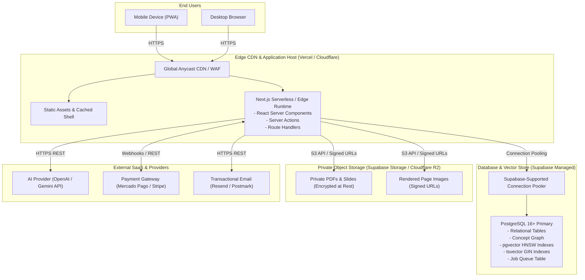

# MedStudy Atlas — Deployment Architecture & Environments

## 1. Environments & Deployment Philosophy
MedStudy Atlas maintains a strict **Local-First** development workflow. Remote cloud environments exist purely for staging verification and production serving:
1. **LOCAL**: Developer's workstation. 100% functional locally with local PostgreSQL (Docker/local) or Supabase CLI. Local review packages generated here.
2. **STAGING**: Ephemeral or persistent preview environment for end-to-end smoke tests and stakeholder acceptance.
3. **PRODUCTION**: High-availability, multi-region CDN edge deployment serving paying medical students.

---

## 2. Production Deployment Topology

---

## 3. Environment Separation Matrix

| Configuration / Resource | LOCAL Environment | STAGING Environment | PRODUCTION Environment |
| :--- | :--- | :--- | :--- |
| **Hosting** | `localhost:3000` | `staging.medstudyatlas.com` (Vercel Preview) | `app.medstudyatlas.com` (Vercel Production) |
| **Database** | Local Postgres (Docker) or Supabase Local | Isolated Staging Supabase Project | Dedicated Production Supabase Project |
| **Storage** | Local Supabase storage bucket | Staging bucket (`medstudy-staging-docs`) | Production bucket (`medstudy-prod-docs`) |
| **AI Provider** | Mock Provider or Low-tier test key with strict spend limit | Shared test key with rate limits | Production key with hard spend caps & alerting |
| **Payment Gateway** | Sandbox / Mock Webhooks | Mercado Pago / Stripe Sandbox Mode | Live Merchant Account (Webhook signature verification) |
| **Email** | Terminal logging (Console stream) | Test inbox (e.g. Mailtrap / Resend test domain) | Production verified domain (DKIM, SPF, DMARC) |
| **Telemetry & Errors** | Disabled / Terminal output | Sentry (staging environment tag) | Sentry (production environment tag) |

---

## 4. Rollback Strategy & Disaster Recovery

### Application Rollback
- **Instant Rollback via Immutable Builds**: Next.js deployments on modern platforms (Vercel / Cloudflare) are immutable. If a critical bug is detected in production:
  1. The operator re-promotes the previous deployment SHA via the dashboard or CLI in < 10 seconds.
  2. Zero server reconfiguration or container re-provisioning is required.

### Database Migration Safety
- **Strictly Additive Migrations**:
  - Phase 1 migrations must be backward-compatible (adding columns with defaults, creating new tables).
  - Destructive operations (dropping columns, changing data types, truncating tables) are prohibited without a phased dual-write migration.
- **Rollback Scripts**: Every migration file (`supabase/migrations/<timestamp>_name.sql`) must be accompanied by a validated rollback script (`..._name.down.sql`).
- **Automated Backups**: Lowest-cost adequate managed backup provided by the chosen production database tier (e.g., daily automated managed backups). Point-in-Time Recovery (PITR) is an optional later control evaluated as scale and revenue warrant.

---

## 5. Security & Network Hardening
1. **Zero Public Database Exposure**: Direct connection to PostgreSQL port 5432 is restricted to Supabase-supported connection pooling appropriate to the chosen runtime and plan, and secure VPC / trusted IP ranges.
2. **Strict CORS & CSP**: Production headers mandate Content-Security-Policy restricting script evaluation, framing (`frame-ancestors 'none'`), and forcing HTTPS.
3. **Signed URLs**: User documents in object storage are never public. Access requires time-limited (max 15 minutes, `INITIAL CONFIGURABLE ASSUMPTION`) HMAC-signed URLs generated server-side.
