# MedStudy Atlas — Document Ingestion Pipeline & Page Provenance

## 1. Overview & Architectural Objectives
Medical students study high-volume academic materials: lecture slides, university guides, summaries, syllabi, clinical guidelines, and PDF handouts. The document processing pipeline must:
1. Ingest files reliably without crashing or exposing server credentials or database infrastructure.
2. Minimize compute overhead and processing time by skipping OCR when native text exists.
3. Extract clean text, layout dimensions, and exact page-level cryptographic provenance (`document_pages`).
4. Prevent worker race conditions, orphaned tasks, and stale state mutations via strict claim fencing.
5. Provide the foundational page provenance layer for downstream deterministic chunking and Study Pack generation (Slice 1E).

---

## 2. Implemented Architecture (Vertical Slice 1D)

```mermaid
flowchart TD
    subgraph UploadBoundary["Phase 1C: Secure Upload Boundary (Implemented)"]
        A["Client File Upload"] --> B["Storage RLS Reservation & Direct Upload\n(private bucket 'documents')"]
        B --> C["Server Finalization (finalizeDocumentUpload)\n- Magic bytes check (%PDF-)\n- Size & quota verification\n- Status: READY"]
        C --> D["Auto-Enqueue Processing\n(enqueue_document_processing_privileged)\n- Status: PENDING\n- Attempt count: 0"]
    end

    subgraph WorkerOrchestrator["Phase 1D: Trusted Node Orchestrator (Implemented)"]
        D --> E["PostgreSQL Queue Coordination\n(claim_next_processing_run)\n- FOR UPDATE SKIP LOCKED\n- claim_token UUID fencing\n- lease_expires_at TIMESTAMPTZ\n- Status: RUNNING"]
        E --> F["Download Source PDF from Storage\n- Computes source_sha256\n- Classifies errors: SOURCE_MISSING vs STORAGE_UNAVAILABLE"]
        F --> G["Temporary Directory Isolation\n(os.tmpdir()/medstudy-atlas-proc/{run_id}-{random_id})"]
        G --> H["Spawn Isolated Python Parser\n(createSafeParserEnvironment - zero secrets)\n- Passes validated PROCESSING_LIMITS config"]
    end

    subgraph ParserSubprocess["Phase 1D: Untrusted Python Parser (Implemented)"]
        H --> I["qpdf 12.4.1 Preflight\n- Encryption check (--is-encrypted)\n- Structural check (--check, accepts warnings code 3)\n- Page count check (--show-npages <= 300)"]
        I --> J{"Preflight Pass?"}
        J -->|No| K["Write FAILED Manifest\n(PDF_ENCRYPTED, PDF_CORRUPT, etc.)"]
        J -->|Yes| L["PDFium 5.13.0 Inspection\n- Native text extraction\n- Page dimensions & rotation\n- Pixel limit guard (12M px/page)"]
        L --> M{"Native chars >= 50?"}
        M -->|Yes| N["Bypass OCR (TEXT_BASED / NATIVE)\n- Zero OCR compute cost"]
        M -->|No| O["Selective Tesseract 5.5.3 OCR\n- Strictly 'spa+eng' languages\n- Bounded scale (144 DPI)\n- Per-page timeout (20s)\n- Max 60 OCR pages/doc"]
        N --> P["Deterministic Text Normalization\n- Strip nulls, normalize LF\n- Preserve prompt injection as inert text"]
        O --> P
        P --> Q["Write manifest.json & pages/NNNN.json\n- Text SHA-256 & char counts"]
    end

    subgraph VerificationAndPersistence["Phase 1D: Trusted Verification & DB Persistence (Implemented)"]
        Q --> R["Bound Output Before readFile()\n- manifest <= 64 KB\n- page JSON <= 1.5 MB\n- page_count <= 300\n- exact file count match"]
        R --> S["Trusted Semantic Provenance Verification\n- manifest.source_sha256 === computed\n- page.text_sha256 === SHA-256(text_content)\n- page.char_count === [...text].length\n- aggregate page counters agree"]
        S --> T{"Provenance Valid?"}
        T -->|No| U["fail_processing_run_privileged\n(PARSER_OUTPUT_INVALID, non-retryable)"]
        T -->|Yes| V["persist_processing_run_results_privileged\n- Requires active claim_token\n- Verifies doc is READY & unarchived\n- Inserts document_pages with composite FK\n- Status: SUCCEEDED"]
        V --> W["Best-Effort Bounded Temp Cleanup\n(finally block)"]
        U --> W
    end
```



---

## 3. Subsystem Implementation Status & Boundaries

| Subsystem Component | Status | Implementation Details |
| :--- | :--- | :--- |
| **Preflight Integrity (`qpdf` 12.4.1)** | `IMPLEMENTED` | Detects encryption (`PDF_ENCRYPTED`), corruption (`PDF_CORRUPT`), zero pages (`PDF_ZERO_PAGES`), and bounds page count ($\le 300$ pages, `PDF_PAGE_COUNT_EXCEEDED`). Code 3 warnings accepted. Diagnostic output capped at 64 KB per stdout/stderr diagnostic stream; kills child and fails with `PREFLIGHT_FAILED` if exceeded. |
| **Native Text Extraction (`pypdfium2` 5.13.0)** | `IMPLEMENTED` | Native digital text extracted via PDFium textpage interface without launching browser runtimes. Bypasses OCR when native characters $\ge 50$. Dimension checked: single-axis $\le 5000$ pt (`PAGE_DIMENSION_EXCEEDED`), render pixel area $\le 12$M pixels (`PAGE_PIXEL_AREA_EXCEEDED`). |
| **Selective OCR (`tesseract` 5.5.3)** | `IMPLEMENTED` | Local Tesseract invoked strictly with `spa+eng` language packs for pages with $< 50$ native characters. Capped at 60 OCR pages/doc (`OCR_PAGE_LIMIT`) and 12M pixels/page. |
| **Prompt Injection Defense** | `IMPLEMENTED` | All content classified as `USER_DOCUMENT_UNTRUSTED`. Prompt injection payloads are preserved verbatim as inert text data without executing. |
| **Subprocess Security Boundary** | `IMPLEMENTED` | Application credentials are not inherited through the parser child-process environment. `createSafeParserEnvironment()` strips all application secrets (`SUPABASE_*`, `DATABASE_URL`, AI keys, auth tokens). Note: stripped environment provides credential isolation, not an OS sandbox. Full OS-level sandboxing (e.g. gVisor, Firecracker, or container seccomp) is an explicit production deployment gate. |
| **Worker Queue & Claim Fencing** | `IMPLEMENTED` | `document_processing_runs` uses PostgreSQL `claim_next_processing_run` (`FOR UPDATE SKIP LOCKED`). Fenced by `claim_token UUID`, `claimed_by TEXT`, and `lease_expires_at TIMESTAMPTZ` (default 900s, bounds 1-3600s). Expired leases (`lease_expires_at <= NOW()`) or missing leases (`lease_expires_at IS NULL`) immediately revoke write authority on persist/fail (raises 55000). |
| **Bounded Retry & Terminal Semantics** | `IMPLEMENTED` | Max 3 attempts. `FAILED_RETRYABLE` may be manually re-enqueued; `FAILED_FINAL` cannot be re-enqueued or claimed. UI offers no retry for terminal failures. Hard parser timeouts (`-1`) classified as `PARSER_TIMEOUT` with `p_retryable: true` before manifest check. |
| **Trusted Provenance Verification** | `IMPLEMENTED` | Trusted Node orchestrator verifies source SHA-256, per-page text SHA-256, Unicode code points, aggregate counters, and pipeline version before persistence. |
| **Archive Race Closure** | `IMPLEMENTED` | `archive_document_privileged` marks active runs `FAILED_FINAL` (`DOCUMENT_ARCHIVED`) and deletes `document_pages`. Stale worker persist is denied on archived documents. |
| **Deterministic Chunking** | `IMPLEMENTED` | Canonical page-bounded chunking engine (`src/modules/study-packs/chunking.ts`). Strictly page-bounded (chunks never cross page boundaries in v1). Target 400–800 tokens, 10–15% overlap. In-memory deduplication and deterministic chunk indexes. Zero vector requirement in 1E. |
| **AI Embeddings & Vector Search** | `DEFERRED` | `pgvector` hybrid search and embeddings generation scheduled for **Vertical Slice 1F (Tutor RAG)**. Zero AI spend in Phase 1E ($0.00). |
| **Docling Structural Parser** | `DEFERRED` | Heavyweight PyTorch/layout parsing deferred post-MVP. |
| **Cloud API OCR Fallback** | `DEFERRED` | Zero external cloud OCR APIs enabled. Local Tesseract `spa+eng` is the sole OCR engine. |
| **Hard Memory Cap & OS Sandbox** | `DEPLOYMENT GATE` | Operating-system-level hard RSS/memory container cap and true OS sandboxing (gVisor / Firecracker / seccomp) constitute an explicit **Deployment Gate** required before public untrusted uploads in production. Currently enforced guards: qpdf preflight (64 KB per stdout/stderr diagnostic stream output cap), 300-page limit, 5000 pt dimension limit, 12M pixel render limit, 100K char/page limit, 600s parser process timeout. |

---

## 4. Operational Resource Budgets & Processing Limits

Centralized in [`src/config/processing-limits.ts`](file:///c:/Users/DR_%20CHAPATIN/Documents/GitHub/medstudy-atlas/src/config/processing-limits.ts) and passed explicitly to the parser subprocess:

| Parameter | Bound | Rationale |
| :--- | :--- | :--- |
| `maxPagesPerDocument` | 300 pages | Accommodates comprehensive medical syllabi and semester slide decks while bounding processing runtime (`PDF_PAGE_COUNT_EXCEEDED`). |
| `maxOcrPagesPerDocument` | 60 pages | Prevents CPU exhaustion on massive scanned books; students are guided to use text-readable PDFs (`OCR_PAGE_LIMIT`). |
| `maxPageDimensionPoints` | 5000 points | Prevents single-axis strip decompression bombs (`PAGE_DIMENSION_EXCEEDED`). |
| `maxRenderPixelsPerPage` | 12,000,000 pixels | ~3000x4000 resolution at 144 DPI; prevents bitmap memory bombs (`PAGE_PIXEL_AREA_EXCEEDED`). |
| `maxExtractedCharsPerPage` | 100,000 chars | Prevents text-inflation decompression bombs (`TEXT_PAGE_LIMIT`). |
| `maxExtractedCharsPerDocument` | 3,000,000 chars | Total text budget across entire document (~600,000 words; `TEXT_DOCUMENT_LIMIT`). |
| `preflightTimeoutSeconds` | 10 seconds | Fast fail for corrupt, locked, or malformed PDFs (`PREFLIGHT_TIMEOUT`). |
| `ocrPageTimeoutSeconds` | 20 seconds | Hard timeout per OCR page; raises `OCR_TIMEOUT` on hung Tesseract processes. |
| `parserProcessTimeoutSeconds` | 600 seconds (10 min) | Operative hard deadline for native extraction and overall subprocess execution (`totalJobTimeoutSeconds` alias; `PARSER_TIMEOUT`). |
| `workerLeaseSeconds` | 900 seconds (15 min) | Automatic lease expiration window for crashed workers before reclaiming ($900s > 600s$). Bounded to range 1–3600s. Expired lease revokes write authority. |
| `maxRetries` | 3 attempts | Bounded retry budget before transitioning to `FAILED_FINAL`. |
| `minNativeCharsForText` | 50 characters | Decision boundary to bypass OCR on digitally authored slides. |
| `pipelineVersion` | `"1.0.0"` | Canonical version for schema and run compatibility. |

---

## 5. Provenance & Database Schema Design

### `document_processing_runs`
Tracks execution state per document and pipeline version:
- `(document_id, pipeline_version)` UNIQUE constraint ensures at most one run per version.
- `(id, document_id, user_id)` composite UNIQUE constraint guarantees ownership consistency.
- `claim_token UUID` provides fencing against stale worker writes.
- `lease_expires_at TIMESTAMPTZ` manages worker ownership leases and crash recovery.
- `attempt_count INT` tracks bounded retries ($\le 3$).

### `document_pages`
Stores normalized text and page-level metadata:
- Composite foreign key: `(processing_run_id, document_id, user_id) REFERENCES document_processing_runs(id, document_id, user_id) ON DELETE CASCADE`.
- `(processing_run_id, page_number)` UNIQUE constraint ensures idempotency.
- Cryptographic hash `text_sha256` records SHA-256 of normalized text for provenance auditing.
- Spatial dimensions: `width_points`, `height_points`, and `rotation_degrees`.
- Extraction provenance: `classification` (`TEXT_BASED`, `SCANNED`, `MIXED`, `NO_TEXT`, `IMAGE_ONLY`) and `extraction_method` (`NATIVE`, `OCR`, `HYBRID`, `NONE`).

---

## 6. Worker Execution & Lifecycle Commands

```bash
# Execute a single processing job from the queue and exit
pnpm worker:documents --once

# Run worker as continuous polling daemon with adaptive backoff
pnpm worker:documents
```

---

## 7. Phase 1E: Canonical Page-Bounded Chunking & Study Pack Generation Pipeline

Building on the verified page provenance layer established in Phase 1D, Phase 1E introduces deterministic chunking and evidence-grounded Study Pack generation.

### 7.1 Page-Bounded Canonical Chunking Invariants
1. **Strict Page Boundaries**: In v1, chunks **never** span multiple pages (`page_start === page_end`). This guarantees unambiguous provenance: every chunk belongs to exactly one physical PDF page.
2. **Deterministic Token Estimation**: Text is tokenized using character-to-token heuristic estimation (target 400–800 tokens, 10–15% overlap) preserving paragraph and sentence boundaries.
3. **Chunk Primary Keys & Composite Integrity**: Chunks are stored in `public.document_chunks` with `(document_id, chunk_index)` uniqueness. Inserted chunks receive database-generated UUIDs that serve as target foreign keys for citations.
4. **Zero-Vector Design in 1E**: The chunking engine requires zero embeddings and zero `pgvector` dependencies in Phase 1E. Embeddings and vector indices are strictly deferred to Phase 1F (Tutor RAG).

### 7.2 Two-Call Generation & Evidence Verification Pipeline
Study Pack creation uses a bounded two-call model to prevent hallucinations and ungrounded clinical claims:
1. **CALL 1: Candidate Generation**:
   - The LLM receives untrusted document chunks serialized as structured JSON data blocks.
   - It outputs candidate study pack sections: General Summary, Learning Objectives, Key Concepts, High-Yield Points, and Key Terms Glossary.
   - For every claim, the model attaches candidate chunk IDs.
2. **CALL 2: Evidence-Support Verification**:
   - An independent verification prompt inspects candidate items alongside cited source text chunks.
   - Each item is classified: `SUPPORTED` or `UNSUPPORTED`.
   - Items lacking direct textual grounding (`UNSUPPORTED`) are stripped from the pack.
3. **Deterministic Citation Validation**:
   - The model is **never** trusted to provide page numbers. The server maps validated `chunk_id` values to their authoritative database `page_number` in `document_chunks`.
4. **Strict QA Status Gate**:
   - A Study Pack is rejected (`FAILED_FINAL`, `STUDY_PACK_EVIDENCE_QA_FAILED`) unless it satisfies:
     - $\ge 1$ General Summary paragraph
     - $\ge 1$ Learning Objective
     - $\ge 1$ Key Concept
     - $\ge 50\%$ of candidate items verified as `SUPPORTED`.
5. **Worker Execution Commands**:
   ```bash
   # Execute a single Study Pack generation job from the queue and exit
   pnpm worker:study-packs --once

   # Run Study Pack worker as continuous polling daemon
   pnpm worker:study-packs
   ```

