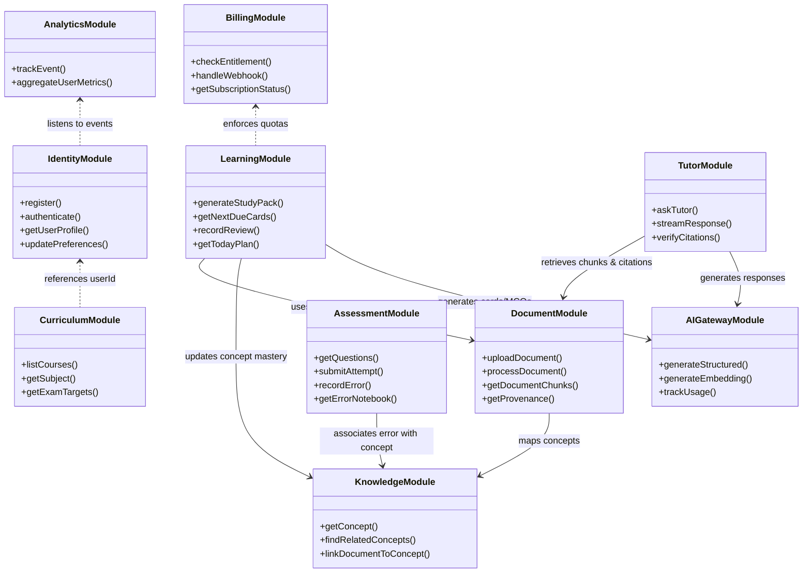

# MedStudy Atlas — Domain Model & Module Architecture

## 1. Architectural Style: Modular Monolith
MedStudy Atlas is architected as a **Modular Monolith**. All domains reside within a single application codebase (`src/modules/*`).
- **NO Microservices**: Microservices introduce distributed transaction complexity, network latency, deployment overhead, and infrastructure costs that directly contradict our low-TCO (~S/ 10/mo) mandate.
- **Strict Logical Boundaries**: Each module exposes a well-defined public interface (service contract). Direct internal file imports across module boundaries are strictly prohibited.
- **Shared Kernel**: Common utilities, shared types, and base error classes reside in `src/shared/*`.

---

## 2. Domain Module Boundaries & Responsibilities

---

## 3. Module Specifications

### 1. Identity Module (`src/modules/identity`)
- **Responsibilities**:
  - User authentication integration (Supabase Auth).
  - User profile management (target exam, year of study, medical school).
  - Session verification and tenant context injection (`tenantId` / `userId`).
  - Account deletion and data export requests.
- **Dependencies**: Database (User, UserProfile).

### 2. Curriculum Module (`src/modules/curriculum`)
- **Responsibilities**:
  - Medical hierarchy: Courses (e.g., Internal Medicine), Subjects (e.g., Cardiology, Nephrology).
  - Standardized exam targets (e.g., ENAM, Essalud, USMLE Step 1, Residentado Médico Perú).
  - Mapping study materials to subjects and exam blueprints.
- **Dependencies**: Database (Course, Subject, ExamTarget).

### 3. Document Module (`src/modules/documents`)
- **Responsibilities**:
  - Document ingestion validation (MIME, size, virus/script check).
  - Storage coordination with private object storage (signed URLs).
  - Orchestration of the text extraction pipeline (classification, extraction, selective OCR).
  - Document structural normalization (pages, sections, chunks).
  - Grounded provenance tracking (bounding boxes, page coordinates).
- **Dependencies**: Object Storage, Database (Document, DocumentVersion, DocumentPage, DocumentSection, DocumentChunk), AI Gateway (embeddings).

### 4. Knowledge Module (`src/modules/knowledge`)
- **Responsibilities**:
  - Medical Concept repository (diseases, symptoms, drugs, anatomical structures).
  - Associative and hierarchical relationships (`IS_A`, `CAUSES`, `TREATED_BY`, etc.).
  - Document-to-concept semantic mapping.
- **Dependencies**: Database (Concept, ConceptRelation, DocumentConcept).

### 5. Learning & Spaced Repetition Module (`src/modules/learning`)
- **Responsibilities**:
  - Study Pack assembly and lifecycle (summary, objectives, key terms, initial cards/questions).
  - Spaced repetition scheduling via `ts-fsrs` (Free Spaced Repetition Scheduler).
  - Management of `UserFlashcardState` and `FlashcardReview`.
  - Learner state tracking (`LearnerConceptState`): mastery, forgetting risk, review history.
  - "Today" engine: Daily prioritized learning plan calculation based on exam target, urgency, and forgetting risk.
- **Dependencies**: Document Module, Knowledge Module, Assessment Module, Database.

### 6. Assessment Module (`src/modules/assessment`)
- **Responsibilities**:
  - Multiple-choice question (MCQ) repository and validation QA.
  - User attempt recording and evaluation (explanation, clinical reasoning feedback).
  - Error Notebook: Tracking recurring misconceptions, categorizing error causes, and feeding weak concepts back into the Today plan.
- **Dependencies**: Knowledge Module, Document Module (provenance citations), Database.

### 7. Tutor Module (`src/modules/tutor`)
- **Responsibilities**:
  - Context-aware RAG query orchestration.
  - Lexical and vector search execution against user documents and curriculum syllabus.
  - Response synthesis with strict provenance citations (exact document, page, section).
  - Evidence state classification: `SUPPORTED`, `PARTIALLY_SUPPORTED`, `INSUFFICIENT_EVIDENCE`.
  - Prompt-injection containment on retrieved evidence.
- **Dependencies**: Document Module, AI Gateway, Database (TutorConversation, TutorMessage, Citation).

### 8. AI Gateway Module (`src/modules/ai`)
- **Responsibilities**:
  - Unified, thin `AIProvider` interface isolating third-party LLM APIs.
  - Centralized telemetry logging (prompt tokens, completion tokens, cached tokens, latency, cost estimate).
  - Hard token ceilings, quota enforcement, request deduplication, and generation caching.
  - Fallback and circuit-breaker handling.
- **Dependencies**: External AI APIs (OpenAI / Anthropic / Gemini).

### 9. Billing & Entitlements Module (`src/modules/billing`)
- **Responsibilities**:
  - Plan definitions (Free vs PRO).
  - Entitlement verification (monthly document upload limit, AI tutor query quota, question generation cap).
  - Webhook processing for payment gateways (Mercado Pago, Stripe) with signature verification and idempotency.
  - Subscription lifecycle management (trial, active, grace period, canceled).
- **Dependencies**: Database (Subscription, Entitlement, PaymentEvent, WebhookEvent).

### 10. Analytics Module (`src/modules/analytics`)
- **Responsibilities**:
  - Product usage event tracking (e.g., `document_processed`, `flashcard_reviewed`, `tutor_message_sent`).
  - Unit-economic tracking (AI cost per active user, margin calculation).
  - Student learning trajectory and retention metrics.
- **Dependencies**: Database (AIUsage, AnalyticsEvent).

---

## 4. Coupling Rules & Invariants

To prevent the modular monolith from degenerating into a "big ball of mud", the following architectural rules are enforced:

1. **Unidirectional Dependencies**:
   - `Tutor` and `Learning` may depend on `Documents`, `Knowledge`, and `AI Gateway`.
   - `Documents` and `Knowledge` must NEVER depend on `Tutor` or `Learning`.
   - `Identity` and `Billing` must never depend on domain modules (`Learning`, `Assessment`, `Tutor`).
2. **Entitlements Gate, Not Logic**:
   - The `Billing` module exposes `checkEntitlement(userId, feature)`. Domain modules invoke this gate before triggering resource-intensive operations, but domain logic itself does not know billing details.
3. **No Cross-Module Database Transactions**:
   - Database tables are owned by their respective modules. Cross-module data access should occur via module service methods or read-only database views, never via arbitrary direct cross-table joins that bypass domain validation.
4. **Isolated AI Provider**:
   - No module (except `AI Gateway`) may directly import external AI SDKs (e.g., `@google/genai`, `openai`). All AI operations pass through `AI Gateway`.
5. **No Medical PHI Allowed**:
   - No module may define or store fields for patient identifying data.
