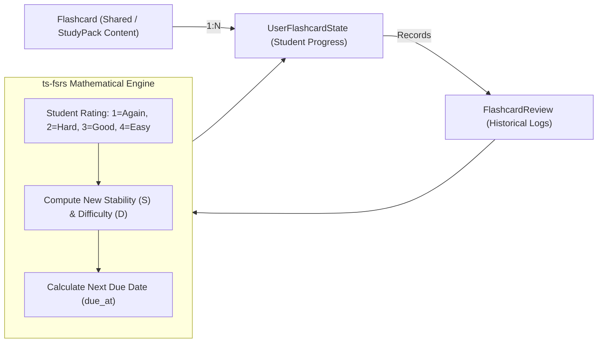
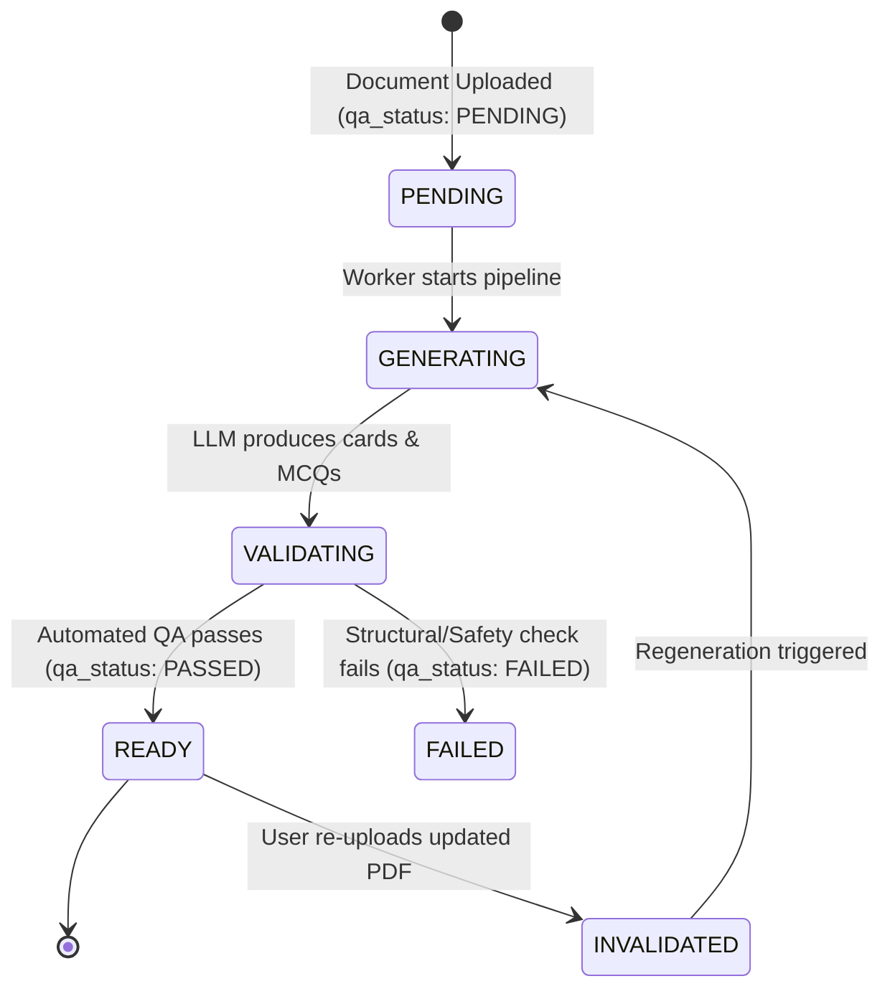

# MedStudy Atlas — Learning Engine: Spaced Repetition, Learner Model & Today Engine

## 1. Overview & Cognitive Science Foundation
MedStudy Atlas is built upon empirically verified principles of cognitive learning science:
1. **Active Retrieval Practice**: Testing knowledge strengthens synaptic memory consolidation far more than passive re-reading.
2. **Spaced Repetition (FSRS)**: Reviewing material at mathematically optimized expanding intervals to prevent memory decay.
3. **Interleaving**: Alternating related medical concepts (e.g., distinguishing Aortic Stenosis from Mitral Regurgitation) to foster deep clinical differentiation.
4. **Metacognitive Calibration**: Aligning the student's perceived confidence with actual objective accuracy to eliminate the "illusion of competence".

---

## 2. Spaced Repetition Architecture: FSRS Algorithm via `open-spaced-repetition/ts-fsrs`

### Separation of Content from Scheduling State
Flashcard content is immutable or versioned independently of student progress:
- **`Flashcard`**: Represents the medical knowledge item (`front`, `back`, `explanation`, `provenance`).
- **`UserFlashcardState`**: Belongs strictly to the individual student, storing FSRS scheduling parameters.

### FSRS Integration & Versioning Clarity
We adopt `open-spaced-repetition/ts-fsrs` (MIT licensed, pure TypeScript) to implement the Free Spaced Repetition Scheduler (FSRS) algorithm:
- **Algorithm vs. Package Distinction**: A clear distinction is maintained between the theoretical FSRS algorithm generations (e.g., FSRS-4, FSRS-4.5, FSRS-5) and the semantic versions of the `ts-fsrs` npm package. The exact npm package version will be formally pinned in Phase 1H (Flashcards & FSRS).
- **Stability ($S$)**: The time in days required for memory retrievability to decay from 100% to 90%.
- **Difficulty ($D$)**: Inherent complexity of the card on a 1–10 scale.
- **State ($State$)**: `0=New`, `1=Learning`, `2=Review`, `3=Relearning`.
- **Deterministic Math**: Zero network requests, zero database queries during computation; the algorithm runs synchronously in the application runtime.

---

## 3. The Learner Model: `LearnerConceptState`

Rather than implementing opaque machine learning or complex psychometric models (IRT, BKT, CAT) during the MVP, MedStudy Atlas uses a **transparent, deterministic Learner Model**.

### Entity Schema & Signals
For every medical concept (e.g., *Cetoacidosis Diabética*), the student has a `LearnerConceptState` record:

| Signal | Type | Range | Description |
| :--- | :--- | :--- | :--- |
| `mastery` | `NUMERIC(3,2)` | `0.00` – `1.00` | Current estimated competence on the concept. |
| `confidence` | `NUMERIC(3,2)` | `0.00` – `1.00` | Student's self-assessed certainty during attempts. |
| `forgetting_risk` | `NUMERIC(3,2)` | `0.00` – `1.00` | Estimated probability that memory has decayed below recall threshold. |
| `attempt_count` | `INT` | $\ge 0$ | Total questions and cards answered for this concept. |
| `correct_count` | `INT` | $\ge 0$ | Successful attempts. |
| `incorrect_count`| `INT` | $\ge 0$ | Unsuccessful attempts. |
| `error_recurrence`| `INT` | $\ge 0$ | Number of times errors repeated after feedback. |
| `last_attempt_at`| `TIMESTAMPTZ` | Timestamp | Date/time of most recent interaction. |
| `next_review_at` | `TIMESTAMPTZ` | Timestamp | Scheduled review target. |

### Deterministic Mastery Calculation
Mastery is computed deterministically after each question attempt or flashcard session:

$$\text{Accuracy} = \frac{\text{correct\_count}}{\text{attempt\_count}}$$

$$\text{RecencyWeight} = \exp\left(-\frac{\Delta t_{\text{days}}}{30}\right)$$

$$\text{Mastery} = 0.6 \cdot \text{Accuracy} + 0.25 \cdot (1 - \text{forgetting\_risk}) + 0.15 \cdot \text{RecencyWeight} - (0.05 \cdot \text{error\_recurrence})$$

*Clamped to $[0.00, 1.00]$.*

### Evolution Path (Post-PMF)
This deterministic formula can be swapped later for Bayesian Knowledge Tracing (BKT) or Item Response Theory (IRT) without altering the database schema, as the historical logs in `question_attempts` and `flashcard_reviews` preserve the underlying data.

---

## 4. The "Today" Engine: Daily Prioritized Learning Plan

The "Today" plan tells the student exactly what to study each day in a focused session (30–60 minutes, `INITIAL CONFIGURABLE ASSUMPTION`), removing decision fatigue.

### Prioritization Formula
Each concept $c$ in the student's curriculum is assigned a **Priority Score**:

$$\text{Priority}(c) = w_1 \cdot \text{ExamUrgency} + w_2 \cdot \text{ForgettingRisk} + w_3 \cdot \text{KnowledgeGap} + w_4 \cdot \text{ErrorRecurrence} + w_5 \cdot \text{CurriculumWeight}$$

### Initial Deterministic Weights (MVP Baseline — Heuristic)
- $w_1 = 0.30$ (**Exam Urgency**): Proximity of the target exam date (e.g., ENAM exam in 60 days vs 300 days).
- $w_2 = 0.25$ (**Forgetting Risk**): Computed directly from FSRS retrievability decay.
- $w_3 = 0.20$ (**Knowledge Gap**): $1.00 - \text{Mastery}$.
- $w_4 = 0.15$ (**Error Recurrence**): Concepts actively logged in the Error Notebook with repeat mistakes.
- $w_5 = 0.10$ (**Curriculum Weight**): High-yield topics in official exam blueprints (e.g., Cardiology carries higher ENAM weight than Dermatology).

*Note*: These weights are initial configurable assumptions and will be calibrated empirically using student performance data post-launch.

---

## 5. Study Pack Architecture & Lifecycle

A **Study Pack** is a pre-generated, cached learning unit produced from an uploaded document. It prevents redundant, expensive AI inference.

### Mandatory QA Status Lifecycle
Both `study_packs.qa_status` and `questions.qa_status` strictly default to `'PENDING'` (unverified):
- **Lifecycle Values**: `'PENDING'`, `'PASSED'`, `'FAILED'`.
- **Default Invariant**: No generated learning material is marked `'PASSED'` by default. It must undergo automated verification.
- **Exposure Invariant**: Only items with `qa_status = 'PASSED'` are presented to students in default study loops.

### Study Pack Contents (JSONB Cached)
1. **Clinical Summary**: High-yield overview of key mechanisms, diagnostic criteria, and management.
2. **Learning Objectives**: 3–5 verifiable learning outcomes aligned with national medical standards.
3. **Core Concepts & Glossary**: 10–20 key medical terms mapped to canonical concepts.
4. **Flashcards**: 15–30 atomic front/back cards with exact page citations (`INITIAL CONFIGURABLE ASSUMPTION`).
5. **Multiple-Choice Questions**: 5–10 clinical vignette MCQs with 5 options (A–E) and rationales (`INITIAL CONFIGURABLE ASSUMPTION`).

---

## 6. Question Generation & Minimum Viable QA

AI-generated medical questions must pass automated validation checks before being presented to students:

| QA Gate | Validation Rule | Action on Failure |
| :--- | :--- | :--- |
| `structureValid` | Exactly 1 correct option, 4 plausible distractors, non-empty vignette. | Reject output; re-prompt with JSON schema. |
| `evidenceSupported` | Correct answer must cite an exact chunk quote in the document. | Flag question; exclude from Study Pack (`qa_status = 'FAILED'`). |
| `distractorsValid` | Distractors must represent real clinical misconceptions, not joke answers. | Filter out low-plausibility distractors. |
| `medicalSafety` | Check against banned clinical recommendations (e.g., dangerous drug dosages). | Immediate discard; alert in QA log (`qa_status = 'FAILED'`). |
| `duplicateRisk` | Jaccard / embedding similarity with existing questions < 0.85. | Discard duplicate question. |

---

## 7. The Error Notebook
When a student answers a question incorrectly, an `ErrorRecord` is automatically created:
1. **Misconception Tagging**: Student or AI tags the failure:
   - `KNOWLEDGE_GAP`: Did not know the medical fact.
   - `MISREAD_QUESTION`: Skipped "EXCEPT", "MOST LIKELY", or laboratory unit.
   - `CONFUSED_CONCEPTS`: Confused two related diseases (e.g., Crohn vs Ulcerative Colitis).
   - `REASONING_ERROR`: Knew facts but applied incorrect diagnostic logic.
2. **Reinforcement Loop**: Unresolved errors are injected with high priority into the Today engine until the student passes 2 consecutive retrieval checks on that concept.
