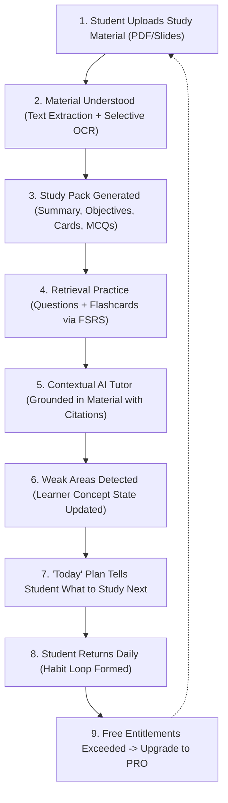
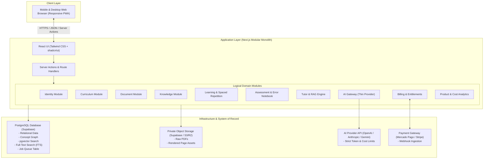

# MedStudy Atlas — System Overview

## 1. Executive Summary & Mission
MedStudy Atlas is a commercial, adaptive medical-learning SaaS platform engineered specifically for medical students in Peru and Latin America. Its mission is to transform dense, high-volume syllabi and study materials into high-yield, structured, and clinically accurate learning loops grounded in evidence-based cognitive science.

## 2. Core Architecture Principles
The architecture of MedStudy Atlas is governed by five foundational pillars:
- **Revenue-First**: Optimize time-to-market over premature sophistication. Prioritize the core loop that drives user retention and willingness-to-pay (~S/ 10/month target).
- **MVP-First**: Build only what is required to validate the core learning loop. Defer complex, speculative capabilities (3D anatomy, multi-modal viewers, enterprise workflows).
- **OSS-First**: Favor mature, permissively licensed open-source tools over custom builds or expensive proprietary SaaS, provided Total Cost of Ownership (TCO) is genuinely low.
- **Local-First**: All development, testing, and external review packages operate independently of remote cloud dependencies or GitHub locks.
- **Low-TCO & Frugality**: Protect unit economics at ~S/ 10/month (~$2.70 USD/month). Minimize compute, aggressive caching, deterministic logic instead of LLMs, and zero idle cloud waste.

### Explicit Architectural Anti-Patterns (Avoid by Default)
- **NO Microservices**: The system is a modular monolith. All domains live inside a single application.
- **NO Kubernetes / Complex Container Orchestration**: Simple serverless / PaaS execution.
- **NO Dedicated Graph Database (Neo4j)**: Concepts and relations are modeled inside PostgreSQL.
- **NO Dedicated Vector Database (Pinecone/Qdrant/Weaviate)**: Embeddings and vector similarity search use PostgreSQL with `pgvector`.
- **NO Complex Message Buses (Kafka/RabbitMQ)**: Background processing uses a lightweight PostgreSQL-backed job queue.
- **NO Autonomous Multi-Agent Swarms**: Deterministic orchestration with narrow LLM calls.
- **NO Premature Machine Learning**: Mastery and spaced repetition use deterministic algorithms (FSRS and deterministic heuristic weights).

---

## 3. The MVP Product Loop
The architecture directly serves a single, cohesive student loop:

---

## 4. System Context & Boundaries

---

## 5. Domain Decomposition Overview
The application is structured as a single modular codebase (`src/modules/*`):
1. **Identity**: User registration, profile, authentication (Supabase Auth integration), sessions.
2. **Curriculum**: University courses, subjects, exam targets (ENAM, Essalud, university finals).
3. **Documents**: Document upload, versioning, page extraction, chunking, and provenance metadata.
4. **Knowledge**: Medical concepts, hierarchical and associative relationships (concept graph in Postgres).
5. **Learning**: Spaced repetition state (FSRS algorithm via `open-spaced-repetition/ts-fsrs`), Study Pack caching, Today engine daily prioritization.
6. **Assessment**: Multiple-choice questions, user attempts, explanations, and Error Notebook.
7. **Tutor**: Context-grounded conversational assistant with exact page/section citations and evidence scoring.
8. **AI Gateway**: Unified, thin abstraction for external LLMs with token tracking, rate limits, and caching.
9. **Billing**: Subscription tiers (Free vs PRO), entitlement enforcement, and webhook reconciliation.
10. **Analytics**: Telemetry for learning velocity, retention, AI token expenditure, and unit margins.

---

## 6. High-Level Technology Stack Decisions
| Layer | Decision | Rationale |
| :--- | :--- | :--- |
| **Framework** | Next.js App Router using the current patched stable release available at Phase 0C initialization (TypeScript) | Unified full-stack, server actions, server components, seamless API routes, robust ecosystem. |
| **UI & Styling** | Tailwind CSS + shadcn/ui | Mobile-first, fast load times, accessible primitives, zero runtime CSS overhead. |
| **System of Record** | PostgreSQL (Supabase) | Multi-model capability (relational, JSONB, full-text search, pgvector), Row Level Security (RLS), and Supabase-supported connection pooling appropriate to the chosen runtime and plan. |
| **Concept Graph** | PostgreSQL adjacency/relation tables | Sufficient for hierarchical and associative medical concepts; avoids Neo4j complexity. |
| **Vector & Search** | PostgreSQL `pgvector` + FTS | Lean hybrid retrieval (lexical + vector) inside the primary database; zero dedicated vector DB cost. |
| **Spaced Repetition** | `ts-fsrs` | Canonical TypeScript implementation of the FSRS algorithm (exact package version pinned in Phase 1H); deterministic, zero external dependencies. |
| **Document Ingestion** | `pdf-inspector` + selective OCR | `pdf-inspector` enables page-level selective OCR and the actual bypass rate will be measured empirically from uploaded medical-study PDFs. |
| **Background Jobs** | PostgreSQL-backed Queue table | Coordinates jobs without executing OCR itself; eliminates Trigger.dev / Redis dependency for MVP; handles retries, idempotency, and timeouts. |
| **Authentication** | Supabase Auth | Built-in email/password, magic links, social login, native integration with Postgres RLS. |
| **Object Storage** | Supabase Storage / S3-compatible | Private buckets, short-lived signed URLs, strict tenant isolation. |
| **AI Abstraction** | Thin internal `AIProvider` | Single provider start, hard token ceilings, centralized telemetry, zero multi-agent overhead. |

---

## 7. Simplicity Pass & Architectural Reductions

Before finalizing the architecture, each potential component was challenged against our simplicity and low-TCO principles:

| Challenge Question | Architectural Simplification Applied |
| :--- | :--- |
| **Can we remove this service?** | Eliminated **Neo4j** (graph DB), **Pinecone** (vector DB), **Redis** (cache/queue), **Kafka** (message bus), and **Trigger.dev** (cloud orchestrator). |
| **Can PostgreSQL already do it?** | **YES**. PostgreSQL handles relational data, the concept graph (adjacency + CTEs), vector similarity (`pgvector`), lexical search (`tsvector`), and background job queuing (`FOR UPDATE SKIP LOCKED`). |
| **Can this remain inside Next.js?** | **YES**. Server Actions and Route Handlers handle all API logic in a single deployment surface. |
| **Can this dependency wait?** | **YES**. `docling`, `three.js`, `cornerstone3D`, `crawl4ai`, and `xyflow` are kept on `WATCH` / deferred to post-MVP phases. |
| **Can deterministic code replace AI?** | **YES**. FSRS spaced repetition, Today plan ranking, document classification, quota enforcement, deduplication, and mastery math use deterministic code ($0 token cost). |
| **Can caching eliminate repeated inference?** | **YES**. Study Packs are generated once and cached in PostgreSQL (`study_packs`), eliminating redundant LLM calls on page loads. |
| **Can generated private content avoid human editorial workflow?** | **YES**. User-private generated questions use automated structural and evidence QA gates, avoiding expensive manual review workflows. |
| **Can the MVP launch without this feature?** | **YES**. 3D anatomy, histology zoom, DICOM viewers, social networks, and BKT/IRT psychometrics are explicitly deferred. |

---

## 8. Conceptual Cost Model & Financial Viability

### Pricing Benchmark & Margin Goals
- **Target Price**: ~S/ 10.00 / user / month (~$2.70 USD / user / month) (`INITIAL CONFIGURABLE ASSUMPTION`).
- **Target Gross Margin**: $\ge 70\%$ (`INITIAL CONFIGURABLE ASSUMPTION`).
- **Commercial Reality**: Profitability is an explicit hypothesis to be empirically validated. Exact provider pricing must be verified before purchase.

### Cost Category Breakdown

| Cost Category | Cost Type | MVP Infrastructure Choice | Estimated Monthly Cost (100 Active Users) | Scalability & Margin Risk |
| :--- | :--- | :--- | :--- | :--- |
| **Frontend Hosting** | **FIXED / AVOIDABLE** | Vercel / Cloudflare Pages | Free allowance / Usage tier | Low risk. Predictable scaling. (PRICE / LIMIT MUST BE VERIFIED FROM OFFICIAL SOURCE BEFORE ADOPTION) |
| **Database & Vector** | **FIXED** | Supabase Managed Postgres | Free / Managed tier | Low risk. Single database manages all subsystems. (PRICE / LIMIT MUST BE VERIFIED FROM OFFICIAL SOURCE BEFORE ADOPTION) |
| **File Storage** | **VARIABLE** | Supabase Storage / Cloudflare R2 | Storage / Egress tier | Very low risk. Negligible storage cost per student. (PRICE / LIMIT MUST BE VERIFIED FROM OFFICIAL SOURCE BEFORE ADOPTION) |
| **Bandwidth / CDN** | **VARIABLE** | Edge CDN (Vercel / Cloudflare) | Included in host tier | Low risk. Static assets cached at edge. (PRICE / LIMIT MUST BE VERIFIED FROM OFFICIAL SOURCE BEFORE ADOPTION) |
| **AI Inference** | **VARIABLE** | Cost-effective LLM via `AIProvider` | Variable; bounded by token caps & quotas | **CRITICAL TO MONITOR**. Managed via hard token caps and caching. Exact provider pricing verified before purchase. |
| **OCR Compute** | **VARIABLE / AVOIDABLE** | Local Tesseract in worker / Capped Cloud OCR | Low / Bounded | Low risk. `pdf-inspector` enables page-level selective OCR; actual bypass rate measured empirically. |
| **Background Compute** | **FIXED / IN-APP** | PostgreSQL-backed Queue in worker | $0.00 (Shared compute) | Zero extra infrastructure. |
| **Transactional Email** | **VARIABLE** | Resend / Postmark | Free / Usage-based tier | Low risk. (PRICE / LIMIT MUST BE VERIFIED FROM OFFICIAL SOURCE BEFORE ADOPTION) |
| **Payment Gateway** | **VARIABLE** | Mercado Pago / Stripe | Gateway fee (% + fixed fee) | Standard merchant fee; scales with revenue. (PRICE / LIMIT MUST BE VERIFIED FROM OFFICIAL SOURCE BEFORE ADOPTION) |
| **Analytics & Logging** | **FIXED / AVOIDABLE** | In-database telemetry + PostHog | In-db ($0) / Managed tier | Low risk. (PRICE / LIMIT MUST BE VERIFIED FROM OFFICIAL SOURCE BEFORE ADOPTION) |
| **Error Monitoring** | **FIXED / AVOIDABLE** | Sentry Developer | Free / Developer tier | Low risk. (PRICE / LIMIT MUST BE VERIFIED FROM OFFICIAL SOURCE BEFORE ADOPTION) |

### Viability Assessment
Profitability is an explicit hypothesis to be empirically validated during the MVP rollout. Operating under the symbolic Unit Economics Framework, variable costs are tightly bounded by caching, deterministic algorithms, and database quotas. Exact provider pricing must be verified before purchase.
