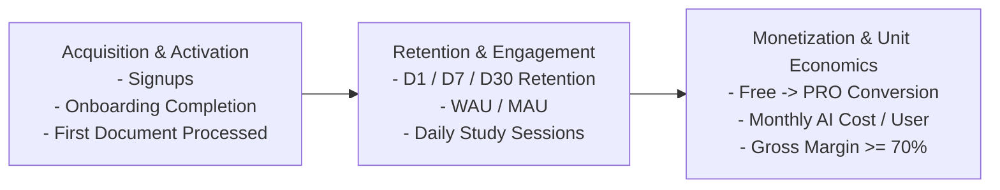

# MedStudy Atlas — Product Analytics & Key Metrics

## 1. Overview
MedStudy Atlas monitors product health, user learning habit formation, and financial unit economics using a lightweight, privacy-respecting telemetry model. We prefer simple in-database logging and lightweight open-source instrumentation before adopting expensive commercial analytics suites.

---

## 2. Core Telemetry Event Schema

Every telemetry event includes:
- `event_id`: UUID
- `user_id`: UUID (anonymized in external exports)
- `event_name`: String
- `timestamp`: ISO-8601 UTC
- `properties`: JSONB key-value metadata

### Standard Event Inventory

| Event Name | Trigger Context | Key Properties |
| :--- | :--- | :--- |
| `onboarding_completed` | Student finishes profile and selects target exam | `target_exam`, `medical_school`, `year_of_study` |
| `document_uploaded` | Student initiates a document upload | `file_size_bytes`, `mime_type`, `subject_id` |
| `document_processed` | Background pipeline finishes parsing document | `duration_ms`, `page_count`, `ocr_pages_count`, `status` |
| `study_pack_opened` | Student opens the generated Study Pack view | `document_id`, `cards_count`, `questions_count` |
| `question_answered` | Student answers an MCQ assessment item | `question_id`, `is_correct`, `response_time_ms`, `concept_id` |
| `flashcard_reviewed` | Student rates a card in spaced repetition | `flashcard_id`, `rating` (1-4), `review_duration_ms` |
| `tutor_message_sent` | Student submits a question to the AI Tutor | `conversation_id`, `tokens_used`, `evidence_state` |
| `study_session_completed` | Student closes active study mode or completes target | `session_duration_minutes`, `items_reviewed_count` |
| `today_plan_started` | Student initiates daily "Today" study session | `plan_date`, `target_minutes`, `item_count` |
| `paywall_viewed` | Upgrade modal or pricing screen is rendered | `trigger_feature` (e.g., upload limit, tutor quota) |
| `subscription_started` | Payment gateway confirms subscription activation | `tier` (PRO), `gateway` (Mercado Pago / Stripe), `billing_cycle` |

---

## 3. Key Performance Indicators (KPIs)

### 1. Activation & Habit Formation
- **Activation Rate**: $\%$ of signed-up users who upload $\ge 1$ document and review $\ge 5$ cards within 24 hours (Target: $\ge 60\%$).
- **Daily Active Habit**: $\%$ of active students completing a "Today" session $\ge 4$ days per week.

### 2. Retention Metrics
- **D1 Retention**: $\%$ of students returning on day 1 (Target: $\ge 45\%$).
- **D7 Retention**: $\%$ of students active 7 days post-signup (Target: $\ge 30\%$).
- **D30 Retention**: $\%$ of students active 30 days post-signup (Target: $\ge 20\%$).
- **WAU / MAU Ratio**: Stickiness indicator measuring weekly vs monthly active engagement (Target: $\ge 0.40$).

### 3. Learning Effectiveness Metrics
- **Questions Answered per Active User / Week**: Measure of active retrieval volume (Target: $\ge 50$).
- **Flashcards Reviewed per Active User / Week**: Measure of spaced repetition habit (Target: $\ge 100$).
- **Error Resolution Rate**: $\%$ of concepts in Error Notebook that transition to "Resolved" within 14 days.

### 4. Financial & Unit Economics Metrics
- **Free $\to$ PRO Conversion Rate**: $\%$ of active free users who upgrade to PRO within 30 days (Target: $\ge 4\%$).
- **Monthly AI Cost per Active User**: Average LLM + embedding cost incurred per user (Target: $\le \$0.80 \text{ USD}$).
- **Gross Margin Proxy**:
  $$\text{Gross Margin} = \frac{\text{Subscription Revenue} - (\text{AI Cost} + \text{Hosting} + \text{Gateway Fees})}{\text{Subscription Revenue}} \ge 70\%$$
- **Monthly Churn Rate**: $\%$ of PRO subscribers canceling per month (Target: $\le 8\%$).
