# MedStudy Atlas — MVP Scope Definition & Implementation Roadmap

## 1. Executive Purpose
This document defines the strict, non-negotiable boundaries of the **MedStudy Atlas Minimum Viable Product (MVP)**. Its purpose is to deliver the fastest credible path to paying medical students (~S/ 10/month) while completely avoiding premature enterprise complexity.

---

## 2. In-Scope MVP Features vs. Deferred Scope

### In-Scope (MVP Required)
1. **Authentication**: Email/password, magic link login, password reset (Supabase Auth).
2. **Onboarding**: Student profile (medical school, year of study, target exam e.g., ENAM/Essalud).
3. **Curriculum Hierarchy**: Courses (e.g. Medicina Interna) and Subjects (Cardiología, Neumología).
4. **Document Library**: Upload PDF slides, view list, processing status, and delete.
5. **Document Ingestion**: Fast page classification (`pdf-inspector`), native text extraction, selective OCR.
6. **Study Pack**: Auto-generated and cached summary, learning objectives, key concepts, flashcards, MCQs.
7. **Flashcards & Spaced Repetition**: Interactive review interface powered by the FSRS algorithm via `open-spaced-repetition/ts-fsrs`.
8. **Assessment & Questions**: Multiple-choice clinical vignette questions with feedback rationales.
9. **Error Notebook**: Automatic logging of missed questions with misconception categorization.
10. **Context-Grounded AI Tutor**: Chat with exact slide/page citations and evidence state badges.
11. **Learner Model**: Deterministic concept mastery and forgetting risk tracking.
12. **"Today" Engine**: Daily prioritized study plan (30–60 min, `INITIAL CONFIGURABLE ASSUMPTION`) based on exam urgency and weak concepts.
13. **Progress Analytics**: Study time, retention rate, mastery overview, and cards due.
14. **AI Cost Controls**: Hard token limits, daily/monthly quotas, and usage telemetry.
15. **Billing Boundary & Entitlements**: Free tier vs PRO tier gating; provider-neutral payment boundary.

### Explicitly Deferred (Post-MVP / Phase 2+)
- **3D Anatomy Viewer** (deferred to Phase 2).
- **Histology Deep-Zoom Viewer** (deferred to Phase 2).
- **DICOM / Radiology Viewer** (deferred to Phase 3).
- **Molecular 3D Structure Viewer** (deferred to Phase 3).
- **Interactive Knowledge Graph UI** (concepts shown as lists/cards in MVP).
- **Native Mobile Apps (iOS/Android)** (mobile-responsive PWA is sufficient for MVP).
- **Institutional / B2B University Portals** (focused 100% on individual students).
- **Social / Community / Peer Comparison** (personal study loop first).
- **Clinical Decision Support / Real-Patient Diagnostic Tools** (strictly forbidden).
- **Item Response Theory (IRT) / Bayesian Knowledge Tracing (BKT)** (deterministic model first).
- **Neo4j / Dedicated Graph Databases** (PostgreSQL relation tables are sufficient).

---

## 3. The Monetization Trigger: Free vs. PRO Tier

MedStudy Atlas operates on a high-conversion freemium model designed to establish a daily study habit before presenting the upgrade paywall:

| Capability | FREE Tier (`INITIAL CONFIGURABLE ASSUMPTION`) | PRO Tier (~S/ 10 / month) (`INITIAL CONFIGURABLE ASSUMPTION`) |
| :--- | :--- | :--- |
| **Document Uploads** | Up to 5 documents / month (max 40 pages/doc) | Up to 50 documents / month (max 100 pages/doc) |
| **Study Packs** | Included for uploaded documents | Included, plus priority generation |
| **Spaced Repetition (FSRS)** | Unlimited flashcard reviews | Unlimited flashcard reviews |
| **AI Tutor Queries** | 10 queries / day | 50 queries / day |
| **"Today" Engine** | Basic daily plan | Full prioritized plan + Error Notebook drilldown |
| **Error Notebook** | Recent 10 errors | Unlimited history & recurring misconception analysis |
| **OCR Support** | Local Tesseract only | Local OCR + Cloud OCR fallback for difficult scans |

---

## 4. Post-Phase 0C Implementation Roadmap (Vertical Slices 1A–1K)

Following Phase 0C (Engineering Baseline), development proceeds in small, fully verifiable vertical slices:

```mermaid
flowchart LR
    S1A["1A: Auth & RLS"] --> S1B["1B: Onboarding & Curriculum"]
    S1B --> S1C["1C: Document Upload & Storage"]
    S1C --> S1D["1D: Text Extraction & Chunks"]
    S1D --> S1E["1E: Study Pack Generation"]
    S1E --> S1F["1F: Tutor RAG & Citations"]
    S1F --> S1G["1G: MCQs & Error Notebook"]
    S1G --> S1H["1H: Flashcards & FSRS"]
    S1H --> S1I["1I: Learner State & Today"]
    S1I --> S1J["1J: Analytics & AI Quotas"]
    S1J --> S1K["1K: Billing & Entitlements"]
```

### Slice Details

#### Slice 1A: Identity, Auth & RLS Baseline
- **User Value**: Student can register, log in, manage session, and delete account.
- **Data Changes**: `user_profiles` table, Supabase Auth integration, RLS policies.
- **AI Impact**: None ($0).
- **Definition of Done**: User logs in with email/password, RLS prevents cross-tenant access, unit/integration tests pass.

#### Slice 1B: Onboarding & Curriculum Targets
- **User Value**: Student selects university, year of study, and target exam (ENAM/Essalud).
- **Data Changes**: `courses`, `subjects`, `exam_targets`, updated `user_profiles`.
- **AI Impact**: None ($0).
- **Definition of Done**: Student completes onboarding wizard; subject hierarchy loads correctly.

#### Slice 1C: Document Library & Private Storage
- **User Value**: Student uploads a PDF syllabus/slide deck and views it in a list.
- **Data Changes**: `documents` table, Supabase private storage bucket, signed URL generator.
- **AI Impact**: None ($0).
- **Definition of Done**: 25MB PDF (`INITIAL CONFIGURABLE ASSUMPTION`) uploads successfully to private bucket; signed URL allows secure viewing via `pdf.js`.

#### Slice 1D: Document Ingestion, Classification & Chunking
- **User Value**: Uploaded document is automatically parsed, pages classified, and chunks indexed.
- **Data Changes**: `document_pages`, `document_chunks` (with FTS `tsvector` and `pgvector` embedding).
- **AI Impact**: Embedding generation via `AIProvider` (variable token cost; provider pricing verified before purchase).
- **Definition of Done**: `pdf-inspector` classifies pages; text extracted; chunks stored with embeddings and FTS tokens.

#### Slice 1E: Study Pack Generation & Caching
- **User Value**: Student opens document and immediately views a structured summary, key concepts, and objectives.
- **Data Changes**: `study_packs` table.
- **AI Impact**: LLM structured completion (variable token cost; cached once in DB; provider pricing verified before purchase).
- **Definition of Done**: Study Pack generated once, cached in DB; reloads do not trigger AI calls.

#### Slice 1F: Context-Grounded AI Tutor
- **User Value**: Student asks questions and receives answers citing exact slide pages with interactive links.
- **Data Changes**: `tutor_conversations`, `tutor_messages`, `citations`.
- **AI Impact**: Hybrid retrieval + LLM synthesis (variable token cost; bounded by token caps; provider pricing verified before purchase).
- **Definition of Done**: Query triggers hybrid SQL search; response includes evidence state badge and verified citations.

#### Slice 1G: Questions & Error Notebook
- **User Value**: Student practices MCQs with clinical feedback; missed questions are saved for review.
- **Data Changes**: `questions`, `question_options`, `question_attempts`, `error_records`.
- **AI Impact**: Question generation during Study Pack assembly.
- **Definition of Done**: Student answers question, receives explanation; incorrect answers appear in Error Notebook.

#### Slice 1H: Flashcards & Spaced Repetition (FSRS)
- **User Value**: Student reviews flashcards with spaced repetition intervals adapted to difficulty.
- **Data Changes**: `flashcards`, `user_flashcard_states`, `flashcard_reviews`.
- **AI Impact**: None ($0) — uses deterministic `ts-fsrs`.
- **Definition of Done**: Reviewing a card updates stability, difficulty, and next due date accurately via FSRS.

#### Slice 1I: Learner Model & "Today" Engine
- **User Value**: Student opens app and sees a tailored study plan (30–60 min, `INITIAL CONFIGURABLE ASSUMPTION`) targeting their weakest concepts.
- **Data Changes**: `learner_concept_states`, `study_plans`, `study_plan_items`.
- **AI Impact**: None ($0) — deterministic weighted formula.
- **Definition of Done**: "Today" screen lists prioritized cards and MCQs based on exam proximity and forgetting risk.

#### Slice 1J: Product Analytics & AI Cost Controls
- **User Value**: Student views study progress; platform enforces monthly usage limits.
- **Data Changes**: `ai_usages` telemetry table.
- **AI Impact**: Telemetry tracking on all AI calls.
- **Definition of Done**: Token limits enforced; circuit breaker stops requests if monthly cap exceeded.

#### Slice 1K: Billing & Entitlements (PRO Upgrade)
- **User Value**: Student upgrades to PRO via local payment gateway to unlock higher limits.
- **Data Changes**: `subscriptions`, `entitlements`, `webhook_events`.
- **AI Impact**: None ($0).
- **Definition of Done**: Webhook processes payment event idempotently; user status transitions from Free to PRO.
