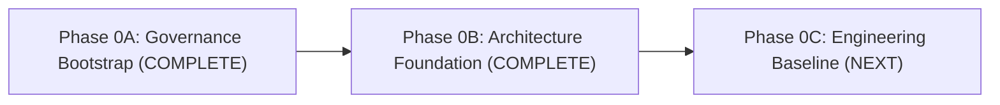

# Phase 0 Roadmap: Project Initialization & Foundation

Phase 0 establishes the institutional, architectural, and engineering foundations of MedStudy Atlas. It is divided into three sequential checkpoints:

---

## Phase 0A: Governance Bootstrap *(Complete)*
- **Status**: Completed and squash-merged into `main`.
- **Goal**: Established invariant rules, agent skills, documentation architecture, safety policies, local-first review workflow, and initial governance baseline.
- **Key Deliverables**:
  - Invariant workspace rules (`.agents/rules/medstudy-core.md`).
  - Focused agent skills: `execution-report`, `dependency-review`, `security-review`, `pr-readiness`.
  - Core governance documentation: Project Charter, Development Governance, Public Safety Policy, Licensing Policy, Medical Asset Policy.
  - Review Package generator (`scripts/create-review-package.ps1`) and `.gitignore` setup.
  - Initial ADR framework and Phase 0A Execution Report.

---

## Phase 0B: Architecture Foundation *(Complete)*
- **Status**: Completed on branch `phase/00b-architecture`.
- **Goal**: Formulate the architectural blueprints, domain boundaries, data models, and service boundaries before writing application code.
- **Key Deliverables**:
  - **System Overview** (`docs/architecture/system-overview.md`): Core loop, system context, anti-patterns.
  - **Domain Model** (`docs/architecture/domain-model.md`): 10 internal modules, coupling rules, modular monolith.
  - **Data Model** (`docs/architecture/data-model.md`): Conceptual & logical PostgreSQL schema, pgvector, FTS, ERD.
  - **Document Pipeline** (`docs/architecture/document-pipeline.md`): Selective OCR strategy, `pdf-inspector`, security controls.
  - **RAG Architecture** (`docs/architecture/rag.md`): In-database hybrid search (FTS + pgvector + RRF), exact citations.
  - **Learning Engine** (`docs/architecture/learning-engine.md`): FSRS (`ts-fsrs`), deterministic learner model, Today engine.
  - **AI Architecture** (`docs/architecture/ai-architecture.md`): Thin `AIProvider`, telemetry, deterministic-first policy, cost caps.
  - **Build vs. OSS vs. API** (`docs/architecture/build-vs-oss-vs-api.md`): Comprehensive 17-subsystem evaluation.
  - **OSS Candidates** (`docs/architecture/oss-candidates.md`): GitHub Scout vetting for 13 candidate repositories.
  - **Deployment Architecture** (`docs/architecture/deployment.md`): 3 environments, topology, rollback strategy.
  - **Security Threat Model** (`docs/security/threat-model.md`): OWASP-aligned MVP threat analysis and mitigations.
  - **Product MVP & Metrics** (`docs/product/mvp-definition.md`, `docs/product/metrics.md`): Scope, monetization, KPIs.
  - **Accepted ADRs** (`docs/adrs/`): ADR 001 through ADR 008.

---

## Phase 0C: Engineering Baseline *(Next Checkpoint)*
- **Status**: Next planned checkpoint.
- **Goal**: Stand up the minimal executable application skeleton, tooling, and local verification pipelines without premature feature code.
- **Planned Scope**:
  1. **Package Management**: Deterministic package manager configuration (`pnpm` pinned via Corepack).
  2. **Application Skeleton**: Clean Next.js App Router structure (using current patched stable release at Phase 0C) in single repository (`src/modules/*`, `src/shared/*`).
  3. **TypeScript Strict Mode**: Zero implicit any, strict null checks (`tsc --noEmit`).
  4. **Tailwind CSS & UI Baseline**: Tailwind CSS with shadcn/ui component primitives.
  5. **Directory & Module Layout**: Clean scaffolding reflecting the 10 domain module boundaries.
  6. **Environment Variable Schema**: Zod-based type-safe environment schema (`@t3-oss/env-nextjs`) with zero secrets committed.
  7. **Code Quality Tooling**: ESLint strict configuration and Prettier formatting rules.
  8. **Unit & Integration Testing**: Vitest test runner setup with sample component and module test.
  9. **Browser & E2E Testing**: Playwright configuration for headless browser smoke verification.
  10. **Local CI-Equivalent Scripts**: Standard npm scripts (`pnpm typecheck`, `pnpm lint`, `pnpm test`, `pnpm build`).
  11. **Secret Scanning & Security Headers**: Automated secret scanning hook and standard HTTP security headers.
  12. **First Localhost Boot**: Verify that `pnpm dev` boots clean on `localhost:3000` with responsive study shell.

