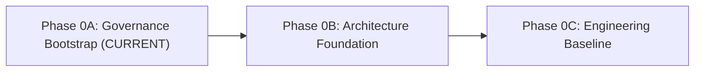

# Phase 0 Roadmap: Project Initialization & Foundation

Phase 0 establishes the institutional, architectural, and engineering foundations of MedStudy Atlas. It is divided into three sequential checkpoints:

---

## Phase 0A: Governance Bootstrap *(Current Checkpoint)*
- **Goal**: Establish invariant rules, agent skills, documentation architecture, safety policies, and branch workflows.
- **Key Deliverables**:
  - Invariant workspace rules (`.agents/rules/medstudy-core.md`).
  - Focused agent skills: `execution-report`, `dependency-review`, `security-review`, `pr-readiness`.
  - Core governance documentation: Project Charter, Development Governance, Public Safety Policy, Licensing Policy, Medical Asset Policy.
  - ADR framework and templates.
  - Execution report template and Phase 0A report.
- **Constraints**:
  - $0 cost incurred.
  - Zero product code.
  - Zero secrets committed.
  - Strictly proprietary (no open-source license).

---

## Phase 0B: Architecture Foundation *(Future Work Only)*
- **Goal**: Formulate the architectural blueprints, domain boundaries, data models, and service boundaries before writing application code.
- **Planned Focus Areas**:
  - **System Architecture**: High-level component topology, request lifecycles, and deployment topologies.
  - **Domain Boundaries**: Clean separation between Identity, Syllabus/Curriculum, Knowledge Graph, Document Processing, Study Engine, Assessment, and Billing.
  - **Data Model**: Relational PostgreSQL schema design, entity relationships, and Row Level Security (RLS) policies.
  - **Medical Knowledge Graph (MKG)**: Graph schema for medical concepts, clinical relationships, and semantic search.
  - **Learner Model**: Mathematical and cognitive specification for memory state tracking, mastery scoring, and forgetting curves.
  - **Adaptive Engine**: Question selection, spaced repetition intervals, and dynamic difficulty adjustment.
  - **Document Ingestion & RAG**: Ingestion pipeline for PDFs/slides, chunking strategies, vector embeddings, and provenance anchoring.
  - **AI Router & Cost Architecture**: Model cascading, fallback policies, token budgeting, and caching strategies.
  - **Security & Analytics Models**: Audit logging, event instrumentation, and threat mitigation.
  - **Substantive ADRs**: Initial set of architectural decisions formally documented.

---

## Phase 0C: Engineering Baseline *(Future Work Only)*
- **Goal**: Stand up the minimal executable application skeleton, tooling, and deterministic verification pipelines.
- **Planned Focus Areas**:
  - **Package Management**: Deterministic package manager configuration (pnpm / corepack).
  - **Application Skeleton**: Clean Next.js app directory structure without bloat.
  - **Type & Code Quality**: TypeScript strict mode, ESLint, Prettier.
  - **Testing Infrastructure**: Vitest for unit/integration tests, Playwright for end-to-end browser verification.
  - **Continuous Integration**: SHA-pinned GitHub Actions workflows with minimal `GITHUB_TOKEN` permissions.
  - **Dependency Automation**: Dependabot configuration for automated security alerts.
  - **Antigravity Hooks**: Implementation of active lifecycle hooks based on validated project commands.
  - **Preview Deployment**: Infrastructure-as-code for staging/preview environments.
