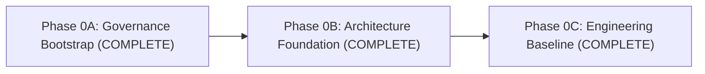

# Phase 0 Roadmap: Project Initialization & Foundation

Phase 0 establishes the institutional, architectural, and engineering foundations of MedStudy Atlas. It is divided into three sequential checkpoints:

---

## Phase 0A: Governance Bootstrap *(Complete)*
- **Status**: Completed and squash-merged into `main`.
- **Goal**: Established invariant rules, agent skills, documentation architecture, safety policies, local-first review workflow, and initial governance baseline.
- **Key Deliverables**:
  - Invariant workspace rules (`.agents/rules/medstudy-core.md`).
  - Focused agent skills: `execution-report`, `dependency-review`, `security-review`, `pr-readiness`.
  - Core governance documentation: Project Charter, Development Governance, Public Safety Policy, Licensing Policy, Medical Asset Policy.
  - Review Package generator (`scripts/create-review-package.ps1`) and `.gitignore` setup.
  - Initial ADR framework and Phase 0A Execution Report.

---

## Phase 0B: Architecture Foundation *(Complete)*
- **Status**: Completed and squash-merged into `main`.
- **Goal**: Formulate the architectural blueprints, domain boundaries, data models, and service boundaries before writing application code.
- **Key Deliverables**:
  - **System Overview** (`docs/architecture/system-overview.md`): Core loop, system context, anti-patterns.
  - **Domain Model** (`docs/architecture/domain-model.md`): 10 internal modules, coupling rules, modular monolith.
  - **Data Model** (`docs/architecture/data-model.md`): Conceptual & logical PostgreSQL schema, pgvector, FTS, ERD.
  - **Document Pipeline** (`docs/architecture/document-pipeline.md`): Selective OCR strategy, `pdf-inspector`, security controls.
  - **RAG Architecture** (`docs/architecture/rag.md`): In-database hybrid search (FTS + pgvector + RRF), exact citations.
  - **Learning Engine** (`docs/architecture/learning-engine.md`): FSRS (`ts-fsrs`), deterministic learner model, Today engine.
  - **AI Architecture** (`docs/architecture/ai-architecture.md`): Thin `AIProvider`, telemetry, deterministic-first policy, cost caps.
  - **Build vs. OSS vs. API** (`docs/architecture/build-vs-oss-vs-api.md`): Comprehensive 17-subsystem evaluation.
  - **OSS Candidates** (`docs/architecture/oss-candidates.md`): GitHub Scout vetting for 13 candidate repositories.
  - **Deployment Architecture** (`docs/architecture/deployment.md`): 3 environments, topology, rollback strategy.
  - **Security Threat Model** (`docs/security/threat-model.md`): OWASP-aligned MVP threat analysis and mitigations.
  - **Product MVP & Metrics** (`docs/product/mvp-definition.md`, `docs/product/metrics.md`): Scope, monetization, KPIs.
  - **Accepted ADRs** (`docs/adrs/`): ADR 001 through ADR 008.

---

## Phase 0C: Engineering Baseline *(Complete)*
- **Status**: Completed and squash-merged into `main`.
- **Goal**: Stand up the minimal executable application skeleton, tooling, and local verification pipelines without premature feature code.
- **Implemented Scope**:
  1. **Package Management**: Deterministic package manager configuration (`pnpm@11.19.0` pinned via Corepack / `packageManager`). Supported Node engine range: `^22.22.2 || ^24.15.0 || >=26.0.0` (verified on `v24.21.0`).
  2. **Application Skeleton**: Clean Next.js 16 App Router structure (Turbopack) in single repository (`src/app/*`, `src/modules/*`, `src/shared/*`).
  3. **TypeScript Strict Mode**: Zero implicit any, strict null checks (`tsc --noEmit`, TypeScript `5.9.3`, `@types/node@24.13.6`).
  4. **Tailwind CSS & UI Baseline**: Tailwind CSS v4 with source-owned shadcn/ui component primitives (`@base-ui/react`, `Button`, `Badge`, `Card`).
  5. **Directory & Module Layout**: Clean scaffolding reflecting the 10 domain module boundaries (`src/modules/*`).
  6. **Environment Variable Schema**: Direct Zod-based type-safe environment schema (`src/config/env.ts`) with zero secrets committed.
  7. **Code Quality Tooling**: ESLint 9 strict flat configuration (`eslint.config.mjs`) and Prettier formatting rules (`.prettierrc`).
  8. **Unit & Integration Testing**: Vitest 5.0.1 test runner with `jsdom@30.1.0` and `@testing-library/react` (16 tests passing).
  9. **Browser & E2E Testing**: Playwright 1.63.0 headless browser smoke verification (4 tests passing across desktop and mobile viewports).
  10. **Local CI-Equivalent Scripts**: Standard npm scripts (`pnpm check`, `pnpm verify`, `pnpm typecheck`, `pnpm lint`, `pnpm test`, `pnpm build`, `pnpm test:e2e`).
  11. **Review-Time Secret Scan & Security Headers**: Automated review-time safety scan in `scripts/create-review-package.ps1` and baseline HTTP security headers in `next.config.ts`.
  12. **First Localhost Boot**: Verified `pnpm dev` and `next start` boot cleanly on `localhost:3000` with responsive study shell and light/dark theme support.

